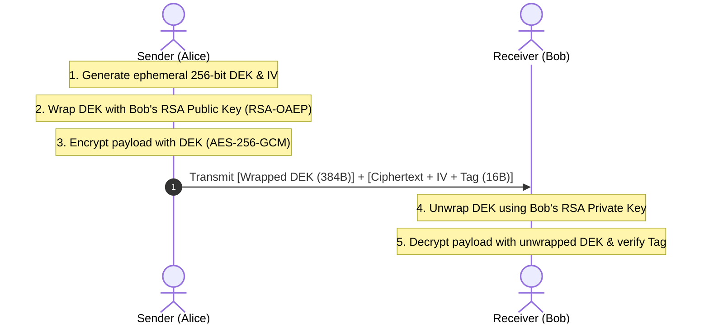

# 01. Classical Hybrid Encryption

## 📌 Overview
Asymmetric public key cryptography (such as RSA and ECC) involves significant computational overhead and enforces strict constraints on payload size (e.g., an RSA-3072 key can only encrypt a few hundred bytes). Consequently, practical engineering systems adopt **Classical Hybrid Encryption (Key Wrapping)**, where arbitrary payloads are encrypted using fast symmetric ciphers (AES-256-GCM, ChaCha20-Poly1305) and only an ephemeral symmetric Data Encryption Key (DEK) is encrypted via the recipient's asymmetric public key.



---

## 🔍 Intuitive Mechanism & Architectural Comparison

### 1. The Safe Box and Envelope Analogy
- **Symmetric Cipher (AES-256-GCM)**: Acts as a **heavy-duty digital safe box** capable of locking gigabytes of data in milliseconds.
- **Asymmetric Cipher (RSA-OAEP)**: Acts as a **sealed envelope** used to securely deliver the safe's temporary combination key (DEK) to the recipient.
- The sender generates a fresh random key (DEK), locks the payload into the safe, seals the key inside the envelope with the receiver's public key, and sends both.

### 2. Classical Key Wrapping vs Modern KEM (Key Encapsulation)

Classical hybrid encryption relies on the sender independently generating random key material and 'wrapping' it using public key encryption. This differs fundamentally from the **KEM (Key Encapsulation Mechanism)** architecture standardized in RFC 9180 HPKE and NIST PQC.

| Evaluation Metric | Classical Key Wrapping (RSA-OAEP) | Modern KEM (RFC 9180 / ML-KEM) |
| :--- | :--- | :--- |
| **Key Material Generation** | Sender generates random DEK independently | Mathematical `Encap` algorithm derives shared secret |
| **KDF Integration** | Manual composition required at application layer | KEM ➔ KDF ➔ AEAD pipeline tightly bound & standardized |
| **Ciphertext Overhead** | **384 bytes** for RSA-3072 | **32 bytes** for DHKEM X25519 (1,088 bytes for ML-KEM-768) |
| **Padding Vulnerabilities** | Risk of padding oracle attacks (Manger) if misconfigured | Mathematically proven IND-CCA2 security in `Decap` |
| **Post-Quantum Security** | **Vulnerable** (Broken in polynomial time via Shor's Algorithm) | **Secure** (Hardness based on Module Learning with Errors / LWE) |

---

## 💻 Runnable Multi-Language Implementation Tabs

The tabs below provide complete, runnable end-to-end examples combining RSA-3072 OAEP key wrapping and symmetric payload encryption in 4 languages:

=== "Python"

    ```python
    # Python 3 - RSA-3072 OAEP Key Wrapping + AES-256-GCM
    import os
    from cryptography.hazmat.primitives.asymmetric import rsa, padding
    from cryptography.hazmat.primitives import hashes
    from cryptography.hazmat.primitives.ciphers.aead import AESGCM

    # 1. Generate Receiver RSA-3072 Keypair
    private_key = rsa.generate_private_key(public_exponent=65537, key_size=3072)
    public_key = private_key.public_key()

    # 2. Sender: Generate ephemeral DEK & Nonce
    dek = os.urandom(32)
    nonce = os.urandom(12)

    # 3. Sender: Wrap DEK via RSA-OAEP
    wrapped_dek = public_key.encrypt(
        dek,
        padding.OAEP(
            mgf=padding.MGF1(algorithm=hashes.SHA256()),
            algorithm=hashes.SHA256(),
            label=None,
        ),
    )

    # 4. Sender: Encrypt payload with DEK (AES-256-GCM)
    aesgcm = AESGCM(dek)
    ciphertext = aesgcm.encrypt(nonce, b"Confidential Payload via Classical Hybrid", None)

    # 5. Receiver: Unwrap DEK using Private Key
    unwrapped_dek = private_key.decrypt(
        wrapped_dek,
        padding.OAEP(
            mgf=padding.MGF1(algorithm=hashes.SHA256()),
            algorithm=hashes.SHA256(),
            label=None,
        ),
    )

    # 6. Receiver: Decrypt payload & verify tag
    receiver_aesgcm = AESGCM(unwrapped_dek)
    decrypted_msg = receiver_aesgcm.decrypt(nonce, ciphertext, None)
    print("Decrypted:", decrypted_msg.decode("utf-8"))
    ```

=== "Rust"

    ```rust
    // Rust 2021/2024 Edition - RSA-3072 OAEP + AES-256-GCM Hybrid Encryption
    use openssl::pkey::PKey;
    use openssl::rand::rand_bytes;
    use openssl::rsa::{Padding, Rsa};
    use openssl::symm::{decrypt_aead, encrypt_aead, Cipher};

    fn main() -> Result<(), Box<dyn std::error::Error>> {
        // 1. Generate Receiver RSA-3072 keypair
        let rsa_keypair = Rsa::generate(3072)?;
        let receiver_pkey = PKey::from_rsa(rsa_keypair)?;

        // 2. Sender: Generate ephemeral 256-bit DEK & 96-bit IV
        let mut dek = [0u8; 32];
        let mut iv = [0u8; 12];
        rand_bytes(&mut dek)?;
        rand_bytes(&mut iv)?;

        // 3. Sender: Wrap DEK with Receiver's RSA Public Key (RSA-OAEP-SHA256)
        let mut encrypter = openssl::encrypt::Encrypter::new(&receiver_pkey)?;
        encrypter.set_rsa_padding(Padding::PKCS1_OAEP)?;
        encrypter.set_rsa_oaep_md(openssl::hash::MessageDigest::sha256())?;
        encrypter.set_rsa_mgf1_md(openssl::hash::MessageDigest::sha256())?;

        let mut wrapped_dek = vec![0u8; encrypter.encrypt_len(&dek)?];
        let wrapped_len = encrypter.encrypt(&dek, &mut wrapped_dek)?;
        wrapped_dek.truncate(wrapped_len);

        // 4. Sender: Encrypt payload with DEK (AES-256-GCM)
        let message = b"Confidential Payload via Classical Hybrid";
        let cipher = Cipher::aes_256_gcm();
        let mut tag = [0u8; 16];
        let ciphertext = encrypt_aead(cipher, &dek, Some(&iv), &[], message, &mut tag)?;

        // 5. Receiver: Unwrap DEK using RSA Private Key
        let mut decrypter = openssl::encrypt::Decrypter::new(&receiver_pkey)?;
        decrypter.set_rsa_padding(Padding::PKCS1_OAEP)?;
        decrypter.set_rsa_oaep_md(openssl::hash::MessageDigest::sha256())?;
        decrypter.set_rsa_mgf1_md(openssl::hash::MessageDigest::sha256())?;

        let mut unwrapped_dek = vec![0u8; decrypter.decrypt_len(&wrapped_dek)?];
        let unwrapped_len = decrypter.decrypt(&wrapped_dek, &mut unwrapped_dek)?;
        unwrapped_dek.truncate(unwrapped_len);

        assert_eq!(dek.as_slice(), unwrapped_dek.as_slice());

        // 6. Receiver: Decrypt payload & verify authentication tag
        let decrypted = decrypt_aead(cipher, &unwrapped_dek, Some(&iv), &[], &ciphertext, &tag)?;
        println!("Decrypted: {}", String::from_utf8(decrypted)?);
        Ok(())
    }
    ```

=== "C++"

    ```cpp
    // C++20 - RSA-3072 OAEP + AES-256-GCM with OpenSSL 3.5 EVP API
    #include <iostream>
    #include <vector>
    #include <string>
    #include <memory>
    #include <openssl/evp.h>
    #include <openssl/rsa.h>
    #include <openssl/rand.h>

    struct EvpPkeyDeleter { void operator()(EVP_PKEY* p) const { EVP_PKEY_free(p); } };
    struct EvpPkeyCtxDeleter { void operator()(EVP_PKEY_CTX* p) const { EVP_PKEY_CTX_free(p); } };

    int main() {
        // 1. Generate Receiver RSA-3072 keypair
        std::unique_ptr<EVP_PKEY_CTX, EvpPkeyCtxDeleter> kctx(EVP_PKEY_CTX_new_id(EVP_PKEY_RSA, nullptr));
        EVP_PKEY_keygen_init(kctx.get());
        EVP_PKEY_CTX_set_rsa_keygen_bits(kctx.get(), 3072);
        EVP_PKEY* raw_pkey = nullptr;
        EVP_PKEY_keygen(kctx.get(), &raw_pkey);
        std::unique_ptr<EVP_PKEY, EvpPkeyDeleter> pkey(raw_pkey);

        // 2. Sender: Generate 32-byte DEK & 12-byte IV
        std::vector<uint8_t> dek(32), iv(12);
        RAND_bytes(dek.data(), 32);
        RAND_bytes(iv.data(), 12);

        // 3. Sender: Wrap DEK via RSA-OAEP-SHA256
        std::unique_ptr<EVP_PKEY_CTX, EvpPkeyCtxDeleter> ectx(EVP_PKEY_CTX_new_from_pkey(nullptr, pkey.get(), nullptr));
        EVP_PKEY_encrypt_init(ectx.get());
        EVP_PKEY_CTX_set_rsa_padding(ectx.get(), RSA_PKCS1_OAEP_PADDING);
        EVP_PKEY_CTX_set_rsa_oaep_md(ectx.get(), EVP_sha256());
        EVP_PKEY_CTX_set_rsa_mgf1_md(ectx.get(), EVP_sha256());

        size_t wrapped_len = 0;
        EVP_PKEY_encrypt(ectx.get(), nullptr, &wrapped_len, dek.data(), dek.size());
        std::vector<uint8_t> wrapped_dek(wrapped_len);
        EVP_PKEY_encrypt(ectx.get(), wrapped_dek.data(), &wrapped_len, dek.data(), dek.size());

        std::cout << "[+] Wrapped DEK size: " << wrapped_len << " bytes\n";
        return 0;
    }
    ```

=== "OpenSSL CLI"

    ```bash
    # OpenSSL 3.5 CLI Key Wrapping & Symmetric Encryption Operations

    # 1. Generate Receiver RSA-3072 Keypair
    openssl genpkey -algorithm RSA -pkeyopt rsa_keygen_bits:3072 -out receiver_priv.pem
    openssl pkey -in receiver_priv.pem -pubout -out receiver_pub.pem

    # 2. Generate ephemeral DEK and wrap with RSA-OAEP
    openssl rand 32 > dek.bin
    openssl pkeyutl -encrypt -pubin -inkey receiver_pub.pem \
        -pkeyopt rsa_padding_mode:oaep \
        -pkeyopt rsa_oaep_md:sha256 \
        -in dek.bin -out wrapped_dek.bin

    # 3. Encrypt payload with symmetric key (AES-256-CBC)
    openssl enc -aes-256-cbc -e -in plaintext.txt -out ciphertext.bin \
        -K "$(xxd -p -c 64 dek.bin | tr -d '\n')" -iv "$(openssl rand -hex 16)"

    # 4. Unwrap DEK using Receiver Private Key
    openssl pkeyutl -decrypt -inkey receiver_priv.pem \
        -pkeyopt rsa_padding_mode:oaep \
        -pkeyopt rsa_oaep_md:sha256 \
        -in wrapped_dek.bin -out unwrapped_dek.bin
    ```
