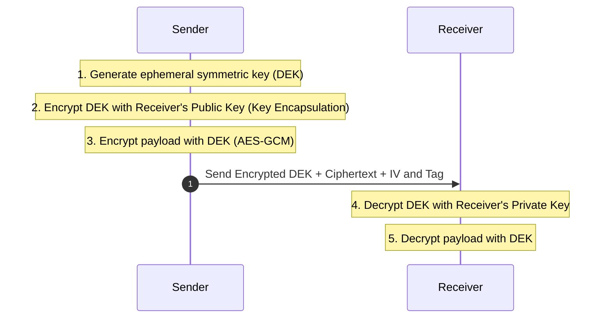

# 01. Classical Hybrid Encryption

## 📌 Overview
Classical hybrid encryption combines asymmetric cryptography (RSA, ECIES) to wrap an ephemeral symmetric key (Data Encryption Key, DEK) with fast authenticated symmetric encryption (AES-GCM, ChaCha20-Poly1305) for encrypting arbitrary payload data.

---

## 🔍 Planned Topics (Phase 2)
- Mechanisms of RSA-OAEP and ECIES key wrapping
- Differences from modern KEM architectures and inherent limitations
- Runnable comparison code in Rust and C++
