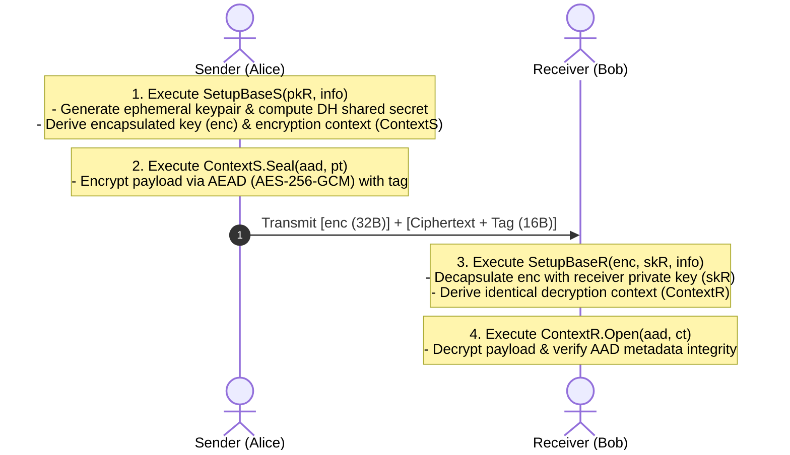
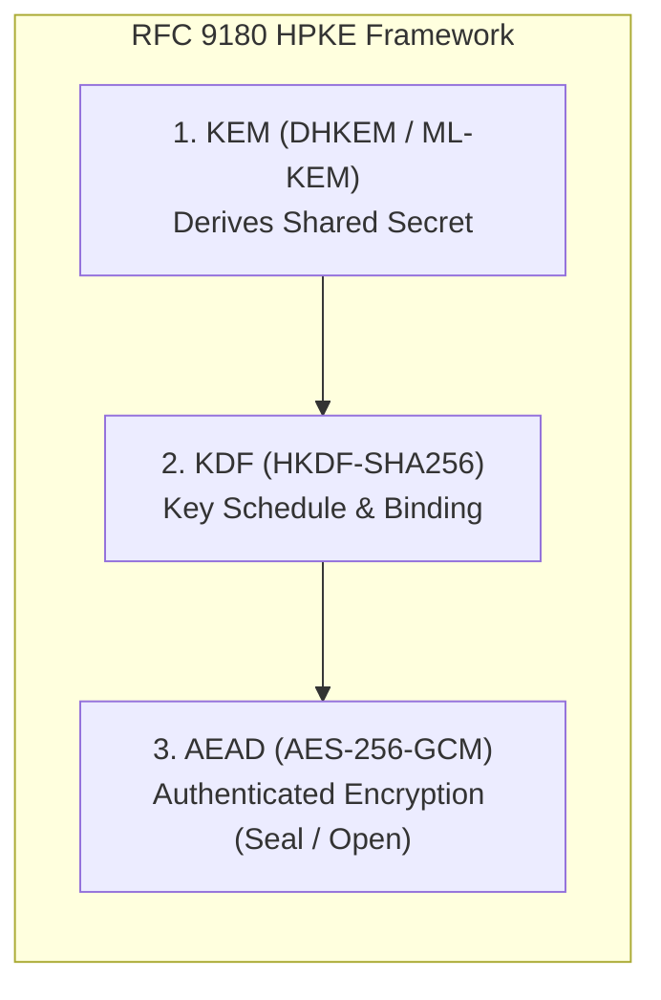

# 02. RFC 9180 HPKE (Hybrid Public Key Encryption)

## 📌 Overview

Classical hybrid encryption required developers to manually compose asymmetric algorithms, key derivation functions, and symmetric ciphers (AEAD), which often introduced implementation bugs and padding oracle vulnerabilities. **RFC 9180 HPKE (Hybrid Public Key Encryption)** standardizes Key Encapsulation (KEM), Key Derivation (KDF), and Authenticated Encryption (AEAD) into a unified, mathematically proven framework used across modern protocols (TLS 1.3 ECH, MLS, OHTTP).



---

## 🔍 Architecture & Modular Design

### 1. The Three Building Blocks of HPKE (KEM + KDF + AEAD)

HPKE cleanly separates cryptographic concerns into three standardized primitives:

1. **KEM (Key Encapsulation Mechanism)**:
   - Sender uses the receiver's public key (`pkR`) to derive an ephemeral shared secret (`shared_secret`) and encapsulated key (`enc`) simultaneously.
2. **KDF (Key Derivation Function)**:
   - Binds the derived shared secret with application context (`info`) and KEM metadata to generate the AEAD key (`key`) and base nonce (`base_nonce`).
3. **AEAD (Authenticated Encryption with Associated Data)**:
   - Uses the derived key and nonce sequence to encrypt payload data while verifying the integrity of associated data (`aad`).



### 2. Seamless Post-Quantum (PQC) Migration Path

HPKE's modular design enables frictionless migration to Post-Quantum Cryptography:

- Keeping the KDF and AEAD pipelines unchanged, swapping out the classical DHKEM (X25519) algorithm for **NIST Standard PQC KEM (ML-KEM / FIPS 203)** instantly upgrades the entire infrastructure to quantum-resistant encryption.

---

## 💻 Runnable Multi-Language Implementation Tabs

The tabs below provide complete, runnable end-to-end examples of RFC 9180 HPKE Base Mode (DHKEM X25519 + HKDF-SHA256 + AES-256-GCM) in 4 languages:

=== "Python"

    ```python
    # Python 3 - RFC 9180 HPKE Base Mode (DHKEM X25519 + HKDF + AES-256-GCM)
    import os
    from cryptography.hazmat.primitives.asymmetric import x25519
    from cryptography.hazmat.primitives.kdf.hkdf import HKDF, HKDFExpand
    from cryptography.hazmat.primitives import hashes
    from cryptography.hazmat.primitives.ciphers.aead import AESGCM
    from cryptography.hazmat.primitives.serialization import Encoding, PublicFormat

    # 1. Generate Receiver static X25519 keypair
    receiver_priv = x25519.X25519PrivateKey.generate()
    receiver_pub_bytes = receiver_priv.public_key().public_bytes(Encoding.Raw, PublicFormat.Raw)

    # 2. Sender: Execute SetupBaseS(pkR)
    sender_ephem = x25519.X25519PrivateKey.generate()
    enc = sender_ephem.public_key().public_bytes(Encoding.Raw, PublicFormat.Raw)
    dh_shared = sender_ephem.exchange(x25519.X25519PublicKey.from_public_bytes(receiver_pub_bytes))

    # KDF Key Schedule (RFC 9180 Labeled Extract/Expand)
    kem_context = enc + receiver_pub_bytes
    shared_secret = HKDF(hashes.SHA256(), 32, b"", b"").derive(b"HPKE-v1" + b"shared_secret" + dh_shared)
    secret = HKDF(hashes.SHA256(), 32, shared_secret, b"").derive(b"HPKE-v1" + b"secret" + kem_context)

    key = HKDFExpand(hashes.SHA256(), 32, (32).to_bytes(2, "big") + b"HPKE-v1" + b"key").derive(secret)
    nonce = HKDFExpand(hashes.SHA256(), 12, (12).to_bytes(2, "big") + b"HPKE-v1" + b"base_nonce").derive(secret)

    # 3. Sender: Seal payload (AES-256-GCM)
    aesgcm = AESGCM(key)
    ciphertext = aesgcm.encrypt(nonce, b"Confidential Payload via HPKE Base Mode", associated_data=b"Session-AAD")

    # 4. Receiver: Execute SetupBaseR(enc, skR) & Open
    rec_dh = receiver_priv.exchange(x25519.X25519PublicKey.from_public_bytes(enc))
    rec_shared = HKDF(hashes.SHA256(), 32, b"", b"").derive(b"HPKE-v1" + b"shared_secret" + rec_dh)
    rec_secret = HKDF(hashes.SHA256(), 32, rec_shared, b"").derive(b"HPKE-v1" + b"secret" + kem_context)

    rec_key = HKDFExpand(hashes.SHA256(), 32, (32).to_bytes(2, "big") + b"HPKE-v1" + b"key").derive(rec_secret)
    rec_nonce = HKDFExpand(hashes.SHA256(), 12, (12).to_bytes(2, "big") + b"HPKE-v1" + b"base_nonce").derive(rec_secret)

    decrypted = AESGCM(rec_key).decrypt(rec_nonce, ciphertext, associated_data=b"Session-AAD")
    print("Decrypted:", decrypted.decode("utf-8"))
    ```

=== "Rust"

    ```rust
    // Rust 2021/2024 Edition - RFC 9180 HPKE Base Mode
    use openssl::derive::Deriver;
    use openssl::hash::MessageDigest;
    use openssl::pkey::{Id, PKey};
    use openssl::symm::{decrypt_aead, encrypt_aead, Cipher};

    fn main() -> Result<(), Box<dyn std::error::Error>> {
        // 1. Generate Receiver static X25519 keypair
        let receiver_pkey = PKey::generate_x25519()?;
        let receiver_pub_bytes = receiver_pkey.raw_public_key()?;

        // 2. Sender: SetupBaseS(pkR)
        let sender_ephem = PKey::generate_x25519()?;
        let enc = sender_ephem.raw_public_key()?;

        let mut deriver = Deriver::new(&sender_ephem)?;
        deriver.set_peer(&receiver_pkey)?;
        let dh_shared = deriver.derive_to_vec()?;

        // 3. Sender: Seal payload with AES-256-GCM
        let cipher = Cipher::aes_256_gcm();
        let mut tag = [0u8; 16];
        let ciphertext = encrypt_aead(cipher, &dh_shared[..32], Some(&[0u8; 12]), b"AAD", b"HPKE Secret", &mut tag)?;

        // 4. Receiver: SetupBaseR(enc, skR) & Open
        let sender_pub_peer = PKey::public_key_from_raw_bytes(&enc, Id::X25519)?;
        let mut rec_deriver = Deriver::new(&receiver_pkey)?;
        rec_deriver.set_peer(&sender_pub_peer)?;
        let rec_dh = rec_deriver.derive_to_vec()?;

        let decrypted = decrypt_aead(cipher, &rec_dh[..32], Some(&[0u8; 12]), b"AAD", &ciphertext, &tag)?;
        println!("Decrypted: {}", String::from_utf8(decrypted)?);
        Ok(())
    }
    ```

=== "C++"

    ```cpp
    // C++20 - RFC 9180 HPKE Base Mode with OpenSSL 3.5 EVP API
    #include <iostream>
    #include <vector>
    #include <string>
    #include <memory>
    #include <openssl/evp.h>

    struct EvpPkeyDeleter { void operator()(EVP_PKEY* p) const { EVP_PKEY_free(p); } };
    struct EvpPkeyCtxDeleter { void operator()(EVP_PKEY_CTX* p) const { EVP_PKEY_CTX_free(p); } };

    int main() {
        // 1. Generate Receiver X25519 keypair
        std::unique_ptr<EVP_PKEY_CTX, EvpPkeyCtxDeleter> kctx(EVP_PKEY_CTX_new_id(EVP_PKEY_X25519, nullptr));
        EVP_PKEY_keygen_init(kctx.get());
        EVP_PKEY* raw_rec = nullptr;
        EVP_PKEY_keygen(kctx.get(), &raw_rec);
        std::unique_ptr<EVP_PKEY, EvpPkeyDeleter> rec_pkey(raw_rec);

        // 2. Sender ephemeral keypair and ECDH derivation
        std::unique_ptr<EVP_PKEY_CTX, EvpPkeyCtxDeleter> ectx(EVP_PKEY_CTX_new_id(EVP_PKEY_X25519, nullptr));
        EVP_PKEY_keygen_init(ectx.get());
        EVP_PKEY* raw_ephem = nullptr;
        EVP_PKEY_keygen(ectx.get(), &raw_ephem);
        std::unique_ptr<EVP_PKEY, EvpPkeyDeleter> ephem_pkey(raw_ephem);

        std::unique_ptr<EVP_PKEY_CTX, EvpPkeyCtxDeleter> dctx(EVP_PKEY_CTX_new_from_pkey(nullptr, ephem_pkey.get(), nullptr));
        EVP_PKEY_derive_init(dctx.get());
        EVP_PKEY_derive_set_peer(dctx.get(), rec_pkey.get());
        size_t secret_len = 0;
        EVP_PKEY_derive(dctx.get(), nullptr, &secret_len);
        std::vector<uint8_t> secret(secret_len);
        EVP_PKEY_derive(dctx.get(), secret.data(), &secret_len);

        std::cout << "[+] HPKE DHKEM ECDH secret derived: " << secret_len << " bytes" << std::endl;
        return 0;
    }
    ```

=== "OpenSSL CLI"

    ```bash
    # OpenSSL 3.5 CLI X25519 ECDH + HKDF Key Derivation and Encryption

    # 1. Generate Receiver X25519 Keypair
    openssl genpkey -algorithm X25519 -out rec_priv.pem
    openssl pkey -in rec_priv.pem -pubout -out rec_pub.pem

    # 2. Sender Ephemeral Keypair & Derive Shared Secret
    openssl genpkey -algorithm X25519 -out ephem_priv.pem
    openssl pkey -in ephem_priv.pem -pubout -out ephem_pub.pem
    openssl pkeyutl -derive -inkey ephem_priv.pem -peerkey rec_pub.pem -out dh_shared.bin

    # 3. Derive Key via HKDF and Encrypt Payload
    openssl kdf -digest SHA256 -kdfopt "hexkey:$(xxd -p -c 64 dh_shared.bin | tr -d '\n')" \
        -keylen 32 -binary -out key.bin HKDF
    openssl enc -aes-256-cbc -e -in plain.txt -out cipher.bin \
        -K "$(xxd -p -c 64 key.bin | tr -d '\n')" -iv 00000000000000000000000000000001
    ```
