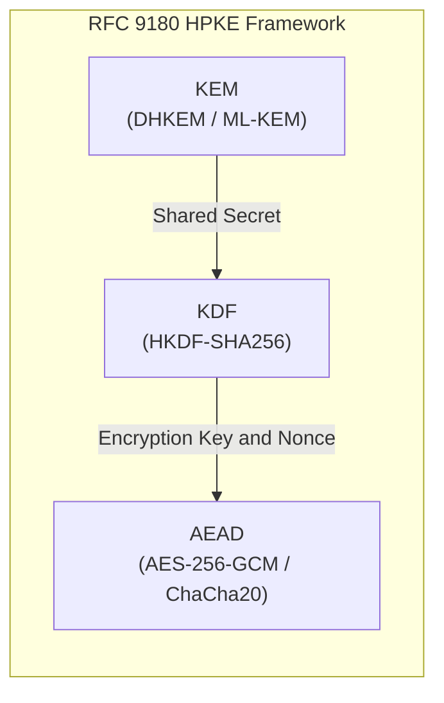

# 02. RFC 9180 HPKE (Hybrid Public Key Encryption)

## 📌 Overview
RFC 9180 HPKE (Hybrid Public Key Encryption) standardizes modern hybrid public-key encryption through a structured framework combining three cryptographic primitives: **KEM (Key Encapsulation Mechanism)**, **KDF (Key Derivation Function)**, and **AEAD (Authenticated Encryption with Associated Data)**.

---

## 🔍 Planned Topics (Phase 2)
- 4 HPKE modes: Base, Auth, PSK, and AuthPSK
- KEM Encapsulation (`Encap`) and Decapsulation (`Decap`) sequences
- OpenSSL 3.5 native C++20 and Rust E2E examples
