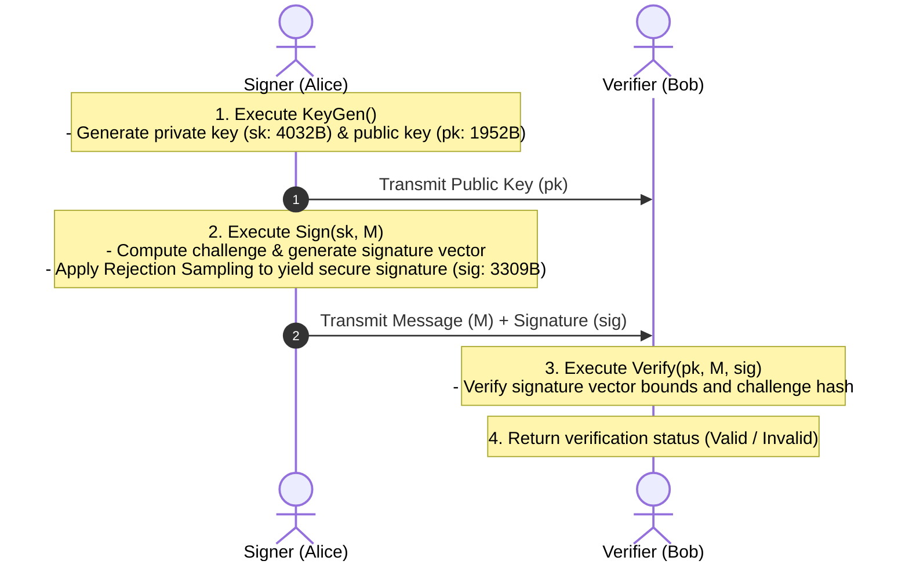
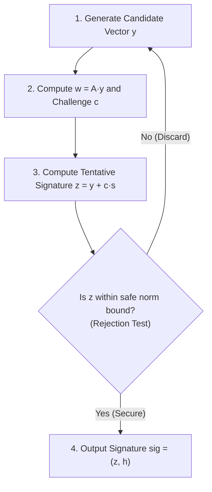

# 03-2. NIST FIPS 204 ML-DSA (Post-Quantum Digital Signatures)

## 📌 Overview
The advent of cryptanalytically relevant quantum computers will completely break classical RSA and ECDSA digital signatures. In response, NIST officially standardized **FIPS 204 ML-DSA (Module-Lattice-Based Digital Signature Algorithm, formerly Dilithium)** in August 2024 as the primary post-quantum digital signature standard.

This document covers the architectural lifecycle (`KeyGen`, `Sign`, `Verify`) of **FIPS 204 ML-DSA**, verified across 4 languages (Python, Rust, C++20, and OpenSSL 3.5+ CLI).



---

## 🔍 Core Mechanism & Security Principles

### 1. Rejection Sampling (Fiat-Shamir with Abort)
- **Preventing Private Key Leakage**:
  - In lattice-based signatures, naive signature vectors correlate with the secret key distribution, allowing attackers to reconstruct the secret key after collecting multiple signatures.
  - ML-DSA incorporates **Rejection Sampling**: if a candidate signature vector exceeds a pre-defined safety bound, it is discarded and recomputed.
  - This ensures that output signatures follow an exact uniform distribution statistically independent of the secret key.



---

## 📊 FIPS 204 ML-DSA Parameter Comparison

NIST standardized three official parameter tiers:

| Parameter Set | Security Strength (NIST Category) | Public Key Size (pk) | Signature Size (sig) | Secret Key Size (sk) | Recommended Application |
| :--- | :--- | :--- | :--- | :--- | :--- |
| **ML-DSA-44** | Cat 2 (SHA-256 collision resistance) | 1,312 Bytes | 2,420 Bytes | 2,560 Bytes | Constrained Embedded / Basic Security |
| **ML-DSA-65** | **Cat 3 (AES-192 equivalent)** | **1,952 Bytes** | **3,309 Bytes** | **4,032 Bytes** | **General Standard (Default for PKI & TLS)** |
| **ML-DSA-87** | Cat 5 (AES-256 equivalent) | 2,592 Bytes | 4,627 Bytes | 4,896 Bytes | High-Security / Long-Term Archival |

---

## 💻 Runnable Multi-Language Implementation Tabs

The tabs below provide complete, runnable end-to-end examples using native OpenSSL 3.5+ FIPS 204 EVP APIs across 4 languages:

=== "Python"

    ```python
    # Python 3 - Native OpenSSL 3.5+ FIPS 204 ML-DSA-65 Sign & Verify
    import ctypes
    from ctypes import c_void_p, c_char_p, c_size_t, POINTER, byref, create_string_buffer

    libcrypto = ctypes.CDLL("/opt/openssl/lib/libcrypto.so")

    libcrypto.EVP_PKEY_CTX_new_from_name.restype = c_void_p
    libcrypto.EVP_MD_CTX_new.restype = c_void_p

    # 1. Signer generates ML-DSA-65 keypair
    kctx = libcrypto.EVP_PKEY_CTX_new_from_name(None, b"ML-DSA-65", None)
    libcrypto.EVP_PKEY_keygen_init(kctx)
    pkey = c_void_p()
    libcrypto.EVP_PKEY_keygen(kctx, byref(pkey))
    libcrypto.EVP_PKEY_CTX_free(kctx)

    message = b"Critical Legal Document authorized by ML-DSA-65 signature."

    # 2. Generate Signature (Sign)
    mctx = libcrypto.EVP_MD_CTX_new()
    libcrypto.EVP_DigestSignInit(mctx, None, None, None, pkey)
    sig_len = c_size_t(0)
    libcrypto.EVP_DigestSign(mctx, None, byref(sig_len), message, len(message))
    sig_buf = create_string_buffer(sig_len.value)
    libcrypto.EVP_DigestSign(mctx, sig_buf, byref(sig_len), message, len(message))
    libcrypto.EVP_MD_CTX_free(mctx)

    # 3. Verify Signature (Verify)
    vmctx = libcrypto.EVP_MD_CTX_new()
    libcrypto.EVP_DigestVerifyInit(vmctx, None, None, None, pkey)
    is_valid = libcrypto.EVP_DigestVerify(vmctx, sig_buf, sig_len.value, message, len(message))
    libcrypto.EVP_MD_CTX_free(vmctx)

    assert is_valid > 0
    print(f"[PASS] ML-DSA-65 Signature Verified! Size: {sig_len.value} bytes")
    libcrypto.EVP_PKEY_free(pkey)
    ```

=== "Rust"

    ```rust
    // Rust 2021/2024 Edition - OpenSSL 3.5 FIPS 204 ML-DSA-65
    use openssl_sys::*;
    use std::ffi::CString;
    use std::ptr;

    fn main() -> Result<(), Box<dyn std::error::Error>> {
        unsafe {
            // 1. Signer generates ML-DSA-65 keypair
            let name = CString::new("ML-DSA-65")?;
            let kctx = EVP_PKEY_CTX_new_from_name(ptr::null_mut(), name.as_ptr(), ptr::null_mut());
            EVP_PKEY_keygen_init(kctx);
            let mut pkey: *mut EVP_PKEY = ptr::null_mut();
            EVP_PKEY_keygen(kctx, &mut pkey);
            EVP_PKEY_CTX_free(kctx);

            let message = b"Critical Legal Document authorized by ML-DSA-65 signature.";

            // 2. Generate Signature (Sign)
            let mctx = EVP_MD_CTX_new();
            EVP_DigestSignInit(mctx, ptr::null_mut(), ptr::null(), ptr::null_mut(), pkey);
            let mut sig_len = 0usize;
            EVP_DigestSign(mctx, ptr::null_mut(), &mut sig_len, message.as_ptr(), message.len());
            let mut sig = vec![0u8; sig_len];
            EVP_DigestSign(mctx, sig.as_mut_ptr(), &mut sig_len, message.as_ptr(), message.len());
            EVP_MD_CTX_free(mctx);

            // 3. Verify Signature (Verify)
            let vmctx = EVP_MD_CTX_new();
            EVP_DigestVerifyInit(vmctx, ptr::null_mut(), ptr::null(), ptr::null_mut(), pkey);
            let ret = EVP_DigestVerify(vmctx, sig.as_ptr(), sig_len, message.as_ptr(), message.len());
            EVP_MD_CTX_free(vmctx);

            assert!(ret > 0);
            println!("[PASS] ML-DSA-65 Signature Verified! Size: {} bytes", sig_len);
            EVP_PKEY_free(pkey);
        }
        Ok(())
    }
    ```

=== "C++"

    ```cpp
    // C++20 - OpenSSL 3.5 EVP API ML-DSA-65
    #include <iostream>
    #include <vector>
    #include <memory>
    #include <cassert>
    #include <openssl/evp.h>

    struct EvpPkeyDeleter { void operator()(EVP_PKEY* p) const { if (p) EVP_PKEY_free(p); } };
    struct EvpPkeyCtxDeleter { void operator()(EVP_PKEY_CTX* p) const { if (p) EVP_PKEY_CTX_free(p); } };
    struct EvpMdCtxDeleter { void operator()(EVP_MD_CTX* p) const { if (p) EVP_MD_CTX_free(p); } };

    int main() {
        // 1. Signer generates ML-DSA-65 keypair
        std::unique_ptr<EVP_PKEY_CTX, EvpPkeyCtxDeleter> kctx(EVP_PKEY_CTX_new_from_name(nullptr, "ML-DSA-65", nullptr));
        EVP_PKEY_keygen_init(kctx.get());
        EVP_PKEY* raw_pkey = nullptr;
        EVP_PKEY_keygen(kctx.get(), &raw_pkey);
        std::unique_ptr<EVP_PKEY, EvpPkeyDeleter> pkey(raw_pkey);

        std::string message = "Critical Legal Document authorized by ML-DSA-65 signature.";

        // 2. Generate Signature (Sign)
        std::unique_ptr<EVP_MD_CTX, EvpMdCtxDeleter> mctx(EVP_MD_CTX_new());
        EVP_DigestSignInit(mctx.get(), nullptr, nullptr, nullptr, pkey.get());
        size_t sig_len = 0;
        EVP_DigestSign(mctx.get(), nullptr, &sig_len, reinterpret_cast<const uint8_t*>(message.data()), message.size());
        std::vector<uint8_t> sig(sig_len);
        EVP_DigestSign(mctx.get(), sig.data(), &sig_len, reinterpret_cast<const uint8_t*>(message.data()), message.size());

        // 3. Verify Signature (Verify)
        std::unique_ptr<EVP_MD_CTX, EvpMdCtxDeleter> vmctx(EVP_MD_CTX_new());
        EVP_DigestVerifyInit(vmctx.get(), nullptr, nullptr, nullptr, pkey.get());
        int ret = EVP_DigestVerify(vmctx.get(), sig.data(), sig.size(), reinterpret_cast<const uint8_t*>(message.data()), message.size());

        assert(ret > 0);
        std::cout << "[PASS] C++20 ML-DSA-65 Verified! Size: " << sig_len << " bytes" << std::endl;
        return 0;
    }
    ```

=== "OpenSSL CLI"

    ```bash
    # OpenSSL 3.5 CLI 기반 FIPS 204 ML-DSA-65 서명 및 검증

    # 1. 서명자 ML-DSA-65 개인키 및 공개키 생성
    openssl genpkey -algorithm ML-DSA-65 -out signer_priv.pem
    openssl pkey -in signer_priv.pem -pubout -out signer_pub.pem

    # 2. 메시지 서명 생성 (Sign)
    echo "PQC Document Payload for Digital Signature" > payload.txt
    openssl pkeyutl -sign -inkey signer_priv.pem -in payload.txt -out sig.bin

    # 3. 서명 검증 (Verify)
    openssl pkeyutl -verify -pubin -inkey signer_pub.pem -sigfile sig.bin -in payload.txt
    ```
