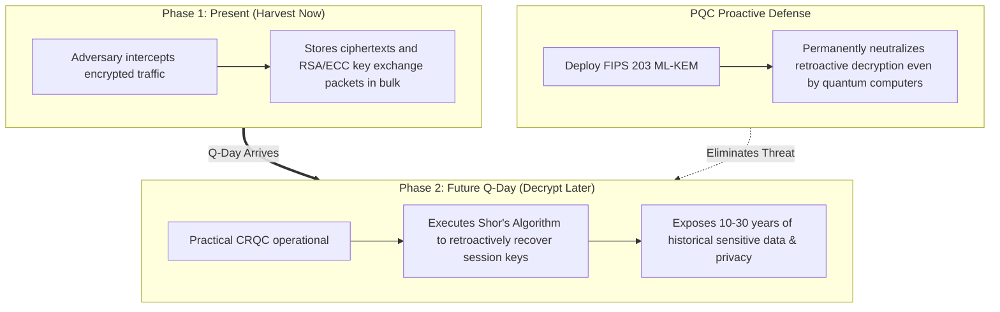
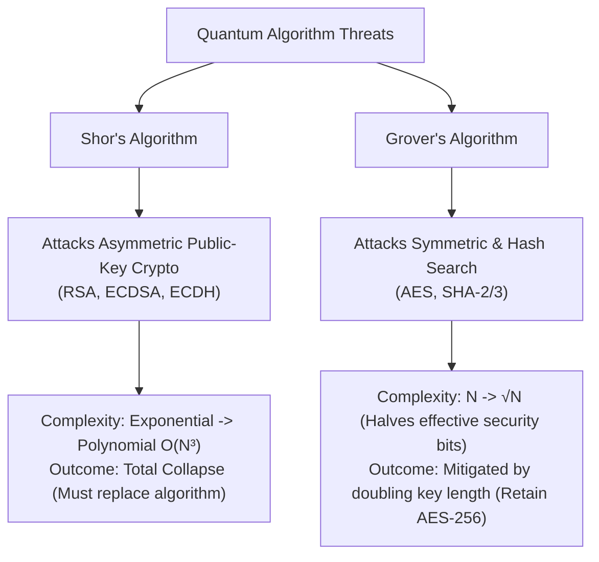
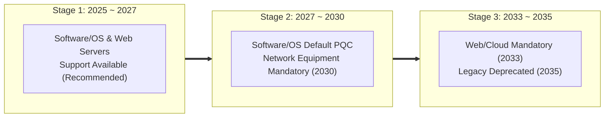

# 03-3. Quantum Threat Models & Security Guidelines (Security Levels & CNSA 2.0)

## 📌 Overview
The realization of cryptanalytically relevant quantum computers threatens the fundamental mathematical foundations (integer factorization, discrete logarithms) underpinning classical internet security. However, different cryptographic algorithms face vastly different threat profiles.

This document analyzes quantum threat models, explains **why symmetric cryptography (AES-256) does not require algorithm replacement**, and outlines migration strategies based on **NIST Security Categories (1/3/5)** and **NSA CNSA 2.0 guidelines**.

---

## 🔍 Quantum Algorithm Threat Analysis

Quantum attacks on cryptography primarily fall into two distinct domains: **Shor's Algorithm** and **Grover's Algorithm**:

### 1. Shor's Algorithm: Total Collapse of Asymmetric Cryptography
- **Targets**: RSA (factoring), ECC/ECDSA/ECDH (elliptic curve discrete logs), DH (finite field discrete logs)
- **Threat Level**: **Catastrophic**
- **Reason**: Shor's algorithm leverages Quantum Fourier Transforms (QFT) to find mathematical periodicity, reducing exponential complexity to **polynomial time $O(n^3)$**. Increasing key sizes is futile; **total migration to lattice-based PQC (ML-KEM / ML-DSA) is mandatory**.

### 2. Grover's Algorithm: Quadratic Speedup on Symmetric Search
- **Targets**: AES-GCM, ChaCha20, SHA-256, SHA-384, SHA-512
- **Threat Level**: **Manageable**
- **Reason**: Grover's algorithm accelerates unstructured database searches from $O(N)$ to **$O(\sqrt{N})$**, effectively cutting security bit strength in **half ($k 
ightarrow k/2$)**.

---

## 🛡 Why Symmetric Cryptography (AES) Needs No Algorithm Replacement

Symmetric ciphers achieve robust post-quantum resilience simply by **maintaining a 256-bit key length**:

| Symmetric Cipher | Classical Security | Effective Quantum Security (Grover) | Status & Recommendation |
| :--- | :--- | :--- | :--- |
| **AES-128** | 128 bits | **64 bits** | ⚠️ **Vulnerable** (Within supercomputing / quantum search reach) |
| **AES-192** | 192 bits | **96 bits** | ⚠️ **Not Recommended** |
| **AES-256** | 256 bits | **128 bits** |  **Secure** (Physically impossible to brute-force) |

> **💡 Practical Takeaway:** 
> In modern cryptography, 128 bits of security is an impenetrable barrier when factoring in physical energy and atomic limits across the observable universe. Because **AES-256 retains a full 128 bits of effective security against quantum search**, PQC architectures simply retain **AES-256-GCM** for bulk payload encryption.

---

## 📊 NIST Post-Quantum Security Categories (1 through 5)

NIST classifies post-quantum algorithms across five security levels benchmarked against symmetric brute-force complexity:

| NIST Category | Benchmark Equivalence | Standard KEM Scheme | Standard Signature Scheme | Recommended Deployment |
| :--- | :--- | :--- | :--- | :--- |
| **Category 1** | AES-128 brute-force search | **ML-KEM-512** | - | Highly constrained IoT / Embedded |
| **Category 2** | SHA-256 collision search | - | **ML-DSA-44** | Constrained digital signatures |
| **Category 3** | **AES-192 brute-force search** | **ML-KEM-768** | **ML-DSA-65** | **General Internet Standard (Default)** |
| **Category 5** | **AES-256 brute-force search** | **ML-KEM-1024** | **ML-DSA-87** | **National Security / Defense / Top Secret** |

---

## 🏛 NSA CNSA 2.0 Guidelines & Transition Roadmap

In September 2022, the US National Security Agency (NSA) released **CNSA 2.0 (Commercial National Security Algorithm Suite 2.0)**, mandating Category 5 security for National Security Systems:

### 1. CNSA 2.0 Algorithm Specifications
- **Key Encapsulation (KEM)**: `ML-KEM-1024` (NIST Cat 5)
- **Digital Signatures**: `ML-DSA-87` (NIST Cat 5) or State-based `LMS` / `XMSS`
- **Symmetric Encryption**: `AES-256`
- **Hash Functions**: `SHA-384` or `SHA-512`

### 2. Phased Transition Roadmap

---

## 🎯 Engineering Decision Matrix

Apply the following matrix based on operational security requirements:

1. **General Web/Mobile Services & Cloud APIs (Category 3 Recommended)**:
   - **Suite**: `ML-KEM-768` + `ML-DSA-65` + `AES-256-GCM`
   - **Rationale**: Public key (1,184B) and ciphertext (1,088B) fit cleanly within 1,500B Ethernet MTUs, avoiding TCP packet fragmentation while delivering robust 192-bit quantum security.
2. **Defense, Core Banking, & Critical Infrastructure (Category 5 / CNSA 2.0 Compliant)**:
   - **Suite**: `ML-KEM-1024` + `ML-DSA-87` + `AES-256-GCM` + `SHA-384`
   - **Rationale**: Satisfies strict NSA CNSA 2.0 mandates and protects data with confidentiality lifetimes exceeding 30–50 years.
