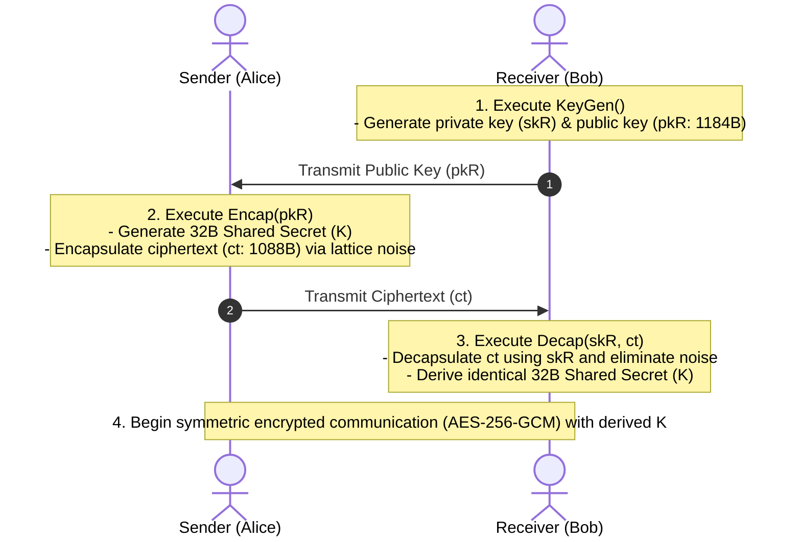

# 03. NIST FIPS 203 ML-KEM (Post-Quantum Key Encapsulation)

## 📌 Overview
In August 2024, the National Institute of Standards and Technology (NIST) officially finalized **FIPS 203 ML-KEM (Module-Lattice-Based Key-Encapsulation Mechanism, formerly Kyber)** as the primary post-quantum standard for public-key encryption to defend against future quantum computers equipped with Shor's algorithm.

This chapter covers the architecture and lifecycle (`KeyGen`, `Encap`, `Decap`) of **FIPS 203 ML-KEM**, verified across 4 languages (Python, Rust, C++20, and OpenSSL 3.5+ CLI).



---

## 🔍 Core Mechanisms & Lattice Cryptography Principles

### 1. Why Quantum Computers Break RSA/ECC but Fail Against Lattices
- **Vulnerability of Classical Cryptography (RSA / ECC)**:
  - Integer factorization and elliptic curve discrete logarithms have structured "periodicity" that Shor's algorithm exploits to solve in polynomial time.
- **Module-LWE (Learning With Errors)**:
  - ML-KEM relies on the hardness of solving **systems of linear equations with intentional small random errors (Noise)** over high-dimensional polynomial lattices.
  - Without the private lattice basis, recovering the secret requires exponential search even for quantum algorithms.


---

## 📊 FIPS 203 ML-KEM Parameter Comparison

NIST standardized three parameter sets targeting distinct security categories:

| Parameter Set | Security Strength (NIST Category) | Public Key Size (pk) | Ciphertext Size (ct) | Shared Secret Size (K) | Recommended Application |
| :--- | :--- | :--- | :--- | :--- | :--- |
| **ML-KEM-512** | Cat 1 (AES-128 equivalent) | 800 Bytes | 768 Bytes | 32 Bytes (256-bit) | Constrained IoT / Embedded |
| **ML-KEM-768** | **Cat 3 (AES-192 equivalent)** | **1,184 Bytes** | **1,088 Bytes** | **32 Bytes (256-bit)** | **General Internet Standard (Default)** |
| **ML-KEM-1024** | Cat 5 (AES-256 equivalent) | 1,568 Bytes | 1,568 Bytes | 32 Bytes (256-bit) | High-Security / Defense |

> **💡 Why is ML-KEM-768 the Global Default?**<br>
> `ML-KEM-768` achieves the ideal balance: both its public key (1,184B) and ciphertext (1,088B) comfortably fit within standard 1,500-byte Ethernet MTUs to avoid TCP fragmentation while delivering robust 192-bit post-quantum security.

---

## 💻 Runnable Multi-Language Implementation Tabs

The tabs below provide complete, runnable end-to-end examples using native OpenSSL 3.5+ FIPS 203 EVP APIs across 4 languages:

=== "Python"

    ```python
    # Python 3 - Native OpenSSL 3.5+ FIPS 203 ML-KEM-768 Encap / Decap
    import ctypes
    from ctypes import c_void_p, c_char_p, c_size_t, c_int, POINTER, byref, create_string_buffer

    libcrypto = ctypes.CDLL("/opt/openssl/lib/libcrypto.so")

    # Define EVP Prototypes
    libcrypto.EVP_PKEY_CTX_new_from_name.restype = c_void_p
    libcrypto.EVP_PKEY_CTX_new.restype = c_void_p

    # 1. Receiver generates ML-KEM-768 keypair
    kctx = libcrypto.EVP_PKEY_CTX_new_from_name(None, b"ML-KEM-768", None)
    libcrypto.EVP_PKEY_keygen_init(kctx)
    pkey = c_void_p()
    libcrypto.EVP_PKEY_keygen(kctx, byref(pkey))
    libcrypto.EVP_PKEY_CTX_free(kctx)

    # 2. Sender executes Encap(pkR) -> (ct: 1088B, secret: 32B)
    ectx = libcrypto.EVP_PKEY_CTX_new(pkey, None)
    libcrypto.EVP_PKEY_encapsulate_init(ectx, None)
    ct_len, secret_len = c_size_t(0), c_size_t(0)
    libcrypto.EVP_PKEY_encapsulate(ectx, None, byref(ct_len), None, byref(secret_len))

    ct_buf = create_string_buffer(ct_len.value)
    secret_s = create_string_buffer(secret_len.value)
    libcrypto.EVP_PKEY_encapsulate(ectx, ct_buf, byref(ct_len), secret_s, byref(secret_len))
    libcrypto.EVP_PKEY_CTX_free(ectx)

    # 3. Receiver executes Decap(skR, ct)
    dctx = libcrypto.EVP_PKEY_CTX_new(pkey, None)
    libcrypto.EVP_PKEY_decapsulate_init(dctx, None)
    dec_len = c_size_t(0)
    secret_r = create_string_buffer(secret_len.value)
    libcrypto.EVP_PKEY_decapsulate(dctx, secret_r, byref(dec_len), ct_buf, ct_len.value)
    libcrypto.EVP_PKEY_CTX_free(dctx)

    assert secret_s.raw == secret_r.raw
    print(f"[PASS] PQC Shared Secret Established: {secret_len.value} bytes")
    libcrypto.EVP_PKEY_free(pkey)
    ```

=== "Rust"

    ```rust
    // Rust 2021/2024 Edition - OpenSSL 3.5 FIPS 203 ML-KEM-768
    use openssl_sys::*;
    use std::ffi::CString;
    use std::ptr;

    fn main() -> Result<(), Box<dyn std::error::Error>> {
        unsafe {
            // 1. Receiver generates ML-KEM-768 keypair
            let name = CString::new("ML-KEM-768")?;
            let kctx = EVP_PKEY_CTX_new_from_name(ptr::null_mut(), name.as_ptr(), ptr::null_mut());
            EVP_PKEY_keygen_init(kctx);
            let mut pkey: *mut EVP_PKEY = ptr::null_mut();
            EVP_PKEY_keygen(kctx, &mut pkey);
            EVP_PKEY_CTX_free(kctx);

            // 2. Sender executes Encap(pkR)
            let ectx = EVP_PKEY_CTX_new(pkey, ptr::null_mut());
            EVP_PKEY_encapsulate_init(ectx, ptr::null_mut());
            let mut ct_len = 0usize;
            let mut secret_len = 0usize;
            EVP_PKEY_encapsulate(ectx, ptr::null_mut(), &mut ct_len, ptr::null_mut(), &mut secret_len);

            let mut ct = vec![0u8; ct_len];
            let mut secret_s = vec![0u8; secret_len];
            EVP_PKEY_encapsulate(ectx, ct.as_mut_ptr(), &mut ct_len, secret_s.as_mut_ptr(), &mut secret_len);
            EVP_PKEY_CTX_free(ectx);

            // 3. Receiver executes Decap(skR, ct)
            let dctx = EVP_PKEY_CTX_new(pkey, ptr::null_mut());
            EVP_PKEY_decapsulate_init(dctx, ptr::null_mut());
            let mut secret_r = vec![0u8; secret_len];
            EVP_PKEY_decapsulate(dctx, secret_r.as_mut_ptr(), &mut secret_len, ct.as_ptr(), ct_len);
            EVP_PKEY_CTX_free(dctx);

            assert_eq!(secret_s, secret_r);
            println!("[PASS] ML-KEM-768 Rust Encap/Decap: ct={}B, secret={}B", ct_len, secret_len);
            EVP_PKEY_free(pkey);
        }
        Ok(())
    }
    ```

=== "C++"

    ```cpp
    // C++20 - OpenSSL 3.5 EVP API ML-KEM-768
    #include <iostream>
    #include <vector>
    #include <memory>
    #include <cassert>
    #include <openssl/evp.h>

    struct EvpPkeyDeleter { void operator()(EVP_PKEY* p) const { if (p) EVP_PKEY_free(p); } };
    struct EvpPkeyCtxDeleter { void operator()(EVP_PKEY_CTX* p) const { if (p) EVP_PKEY_CTX_free(p); } };

    int main() {
        // 1. Receiver generates ML-KEM-768 keypair
        std::unique_ptr<EVP_PKEY_CTX, EvpPkeyCtxDeleter> kctx(EVP_PKEY_CTX_new_from_name(nullptr, "ML-KEM-768", nullptr));
        EVP_PKEY_keygen_init(kctx.get());
        EVP_PKEY* raw_pkey = nullptr;
        EVP_PKEY_keygen(kctx.get(), &raw_pkey);
        std::unique_ptr<EVP_PKEY, EvpPkeyDeleter> pkey(raw_pkey);

        // 2. Sender Encap
        std::unique_ptr<EVP_PKEY_CTX, EvpPkeyCtxDeleter> ectx(EVP_PKEY_CTX_new(pkey.get(), nullptr));
        EVP_PKEY_encapsulate_init(ectx.get(), nullptr);
        size_t ct_len = 0, secret_len = 0;
        EVP_PKEY_encapsulate(ectx.get(), nullptr, &ct_len, nullptr, &secret_len);
        std::vector<uint8_t> ct(ct_len), secret_s(secret_len);
        EVP_PKEY_encapsulate(ectx.get(), ct.data(), &ct_len, secret_s.data(), &secret_len);

        // 3. Receiver Decap
        std::unique_ptr<EVP_PKEY_CTX, EvpPkeyCtxDeleter> dctx(EVP_PKEY_CTX_new(pkey.get(), nullptr));
        EVP_PKEY_decapsulate_init(dctx.get(), nullptr);
        std::vector<uint8_t> secret_r(secret_len);
        EVP_PKEY_decapsulate(dctx.get(), secret_r.data(), &secret_len, ct.data(), ct_len);

        assert(secret_s == secret_r);
        std::cout << "[PASS] C++20 ML-KEM-768 Verified: ct=" << ct_len << "B, secret=" << secret_len << "B" << std::endl;
        return 0;
    }
    ```

=== "OpenSSL CLI"

    ```bash
    # OpenSSL 3.5 CLI 기반 FIPS 203 ML-KEM-768 Encap / Decap

    # 1. Receiver generates ML-KEM-768 keypair
    openssl genpkey -algorithm ML-KEM-768 -out rec_priv.pem
    openssl pkey -in rec_priv.pem -pubout -out rec_pub.pem

    # 2. Sender encapsulates 32-byte shared secret (Encap)
    openssl pkeyutl -encap -pubin -inkey rec_pub.pem -out ct.bin -secret sender_secret.bin

    # 3. Receiver decapsulates shared secret (Decap)
    openssl pkeyutl -decap -inkey rec_priv.pem -in ct.bin -secret rec_secret.bin

    # 4. Verify derived 256-bit shared secrets match
    diff -u sender_secret.bin rec_secret.bin
    ```
