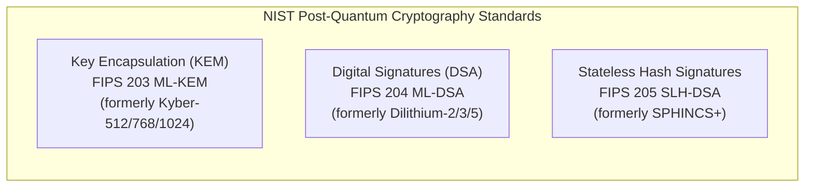

# 03. NIST Post-Quantum Cryptography Primitives

## 📌 Overview
The National Institute of Standards and Technology (NIST) finalized and released official post-quantum cryptography standards that are resilient against Shor's algorithm on quantum computers. This lab focuses on **FIPS 203 (ML-KEM)** and **FIPS 204 (ML-DSA)**.

---

## 🔍 Planned Topics (Phase 3)
- FIPS 203 ML-KEM KeyGen, Encapsulation (`Encap`), and Decapsulation (`Decap`) visualized
- FIPS 204 ML-DSA Signature generation and verification mechanisms
- Quantum security levels (NIST Cat 1/3/5, CNSA 2.0 recommendations) and key/ciphertext size trade-offs
- Native bindings and CLI in OpenSSL 3.5+, Rust, and C++
