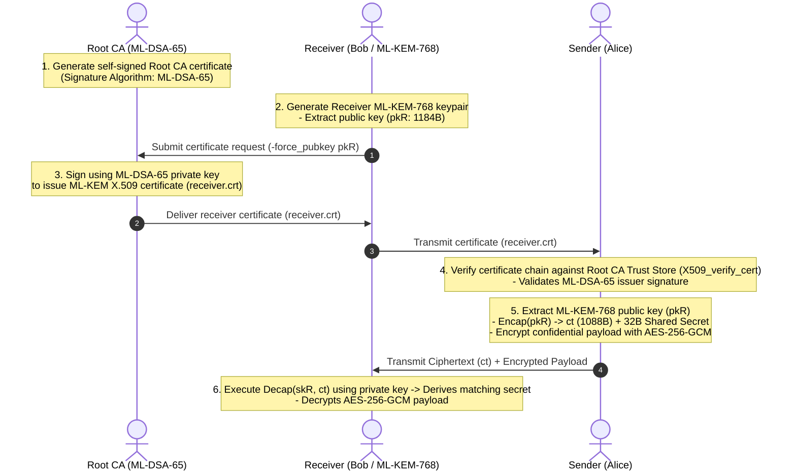
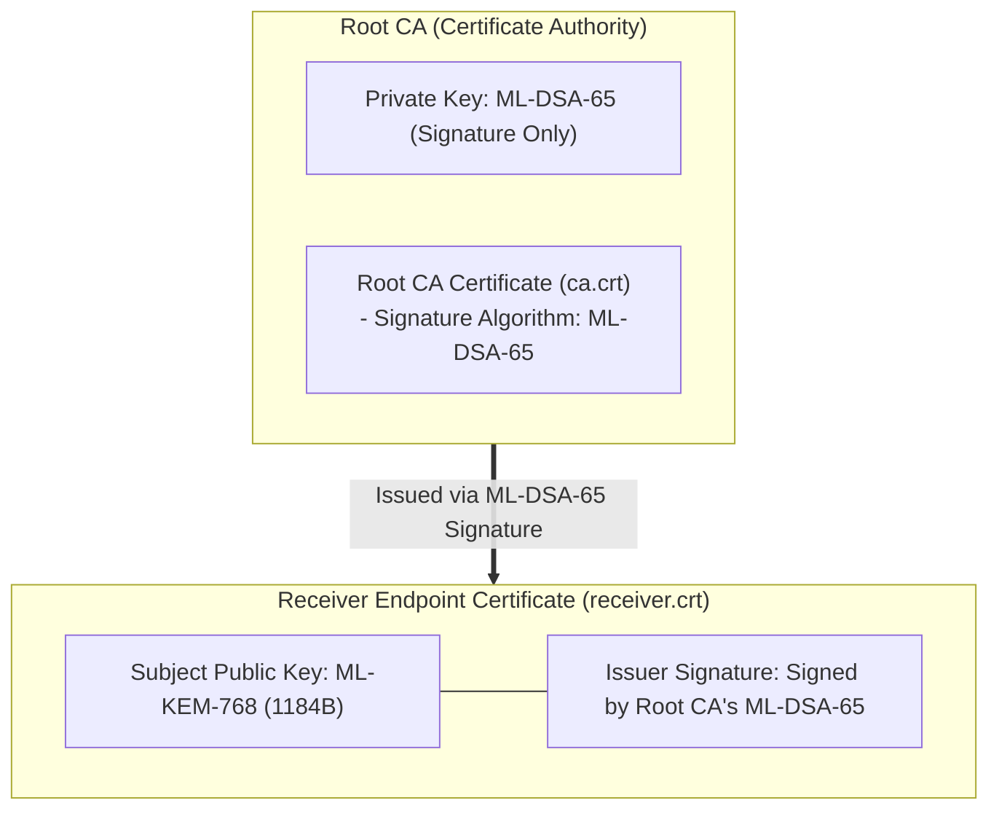

# 04. PQC X.509 PKI & End-to-End Encryption

## 📌 Overview
Classical public-key cryptography (RSA) could handle both digital signatures and key encryption with a single algorithm. In contrast, Post-Quantum Cryptography strictly divides duties between **Key Encapsulation Mechanisms (FIPS 203 ML-KEM)** and **Digital Signature Algorithms (FIPS 204 ML-DSA)**.

Consequently, quantum-resistant X.509 Public Key Infrastructure (PKI) requires a **Dual-Key Architecture**: **ML-DSA is used for CA issuing and signing**, while **ML-KEM is embedded in end-entity certificates for encryption endpoints**.

This chapter covers automated PQC PKI issuance (`run_pki.sh`) and end-to-end (E2E) encryption verified across 4 languages (Python, Rust, C++20, and OpenSSL CLI).



---

## 🔍 PQC Dual-Key PKI Architecture



### 1. Why `-force_pubkey` is Essential for KEM Certificates
- **Classical CSR Proof-of-Possession Limitations**:
  - Standard CSRs (PKCS#10) require a self-signature from the key to prove possession.
  - Because **ML-KEM is strictly a key encapsulation algorithm**, it cannot produce digital signatures.
- **OpenSSL 3.5 Solution**:
  - OpenSSL 3.5+ CLI allows CAs to directly inject the ML-KEM public key into the X.509 certificate's `SubjectPublicKeyInfo` via `-force_pubkey receiver_pub.pem`.

---

## 💻 Runnable Multi-Language Implementation Tabs

The tabs below demonstrate verifying the PQC X.509 certificate chain, extracting the ML-KEM public key, and executing end-to-end AES-256-GCM encryption across 4 languages:

=== "Python"

    ```python
    # Python 3 - OpenSSL 3.5+ PQC X.509 Chain Verification + ML-KEM-768 + AES-256-GCM
    import ctypes
    from ctypes import c_void_p, c_char_p, c_size_t, c_int, POINTER, byref, create_string_buffer

    libcrypto = ctypes.CDLL("/opt/openssl/lib/libcrypto.so")

    # 1. Load certificates
    bio_ca = libcrypto.BIO_new_file(b"ca.crt", b"r")
    ca_cert = libcrypto.PEM_read_bio_X509(bio_ca, None, None, None)
    bio_leaf = libcrypto.BIO_new_file(b"receiver.crt", b"r")
    leaf_cert = libcrypto.PEM_read_bio_X509(bio_leaf, None, None, None)

    # 2. Verify X.509 certificate chain (ML-DSA-65 signature)
    store = libcrypto.X509_STORE_new()
    libcrypto.X509_STORE_add_cert(store, ca_cert)
    vctx = libcrypto.X509_STORE_CTX_new()
    libcrypto.X509_STORE_CTX_init(vctx, store, leaf_cert, None)
    assert libcrypto.X509_verify_cert(vctx) == 1
    print("[PASS] X.509 Certificate Chain Verified (ML-DSA-65 Root CA)!")

    # 3. Extract ML-KEM-768 public key from verified cert and Encap
    extracted_pk = libcrypto.X509_get0_pubkey(leaf_cert)
    ectx = libcrypto.EVP_PKEY_CTX_new(extracted_pk, None)
    libcrypto.EVP_PKEY_encapsulate_init(ectx, None)
    ct_len, secret_len = c_size_t(0), c_size_t(0)
    libcrypto.EVP_PKEY_encapsulate(ectx, None, byref(ct_len), None, byref(secret_len))
    ct_buf = create_string_buffer(ct_len.value)
    secret_s = create_string_buffer(secret_len.value)
    libcrypto.EVP_PKEY_encapsulate(ectx, ct_buf, byref(ct_len), secret_s, byref(secret_len))

    # 4. Receiver decapsulates with private key
    bio_priv = libcrypto.BIO_new_file(b"receiver.key", b"r")
    rec_priv = libcrypto.PEM_read_bio_PrivateKey(bio_priv, None, None, None)
    dctx = libcrypto.EVP_PKEY_CTX_new(rec_priv, None)
    libcrypto.EVP_PKEY_decapsulate_init(dctx, None)
    secret_r = create_string_buffer(secret_len.value)
    dec_len = c_size_t(secret_len.value)
    libcrypto.EVP_PKEY_decapsulate(dctx, secret_r, byref(dec_len), ct_buf, ct_len.value)

    assert secret_s.raw == secret_r.raw
    print("[PASS] PQC X.509 PKI End-to-End Key Establishment Succeeded!")
    ```

=== "Rust"

    ```rust
    // Rust 2021/2024 Edition - PQC X.509 PKI E2E Encryption
    use openssl::x509::{store::X509StoreBuilder, X509StoreContext, X509};
    use openssl::pkey::PKey;
    use openssl::stack::Stack;
    use foreign_types::ForeignType;
    use openssl_sys::*;
    use std::fs;
    use std::ptr;

    fn main() -> Result<(), Box<dyn std::error::Error>> {
        let ca_cert = X509::from_pem(&fs::read("ca.crt")?)?;
        let leaf_cert = X509::from_pem(&fs::read("receiver.crt")?)?;

        // 1. Verify certificate chain
        let mut store_builder = X509StoreBuilder::new()?;
        store_builder.add_cert(ca_cert)?;
        let store = store_builder.build();
        let mut ctx = X509StoreContext::new()?;
        let chain = Stack::new()?;
        assert!(ctx.init(&store, &leaf_cert, &chain, |c| c.verify_cert())?);
        println!("[PASS] Rust X.509 Certificate Chain Verified!");

        // 2. Extract ML-KEM-768 public key and Encap
        let pubkey = leaf_cert.public_key()?;
        let (ct, sender_secret) = unsafe {
            let ectx = EVP_PKEY_CTX_new(pubkey.as_ptr(), ptr::null_mut());
            EVP_PKEY_encapsulate_init(ectx, ptr::null_mut());
            let mut ct_len = 0usize;
            let mut secret_len = 0usize;
            EVP_PKEY_encapsulate(ectx, ptr::null_mut(), &mut ct_len, ptr::null_mut(), &mut secret_len);
            let mut ct = vec![0u8; ct_len];
            let mut secret = vec![0u8; secret_len];
            EVP_PKEY_encapsulate(ectx, ct.as_mut_ptr(), &mut ct_len, secret.as_mut_ptr(), &mut secret_len);
            EVP_PKEY_CTX_free(ectx);
            (ct, secret)
        };

        // 3. Receiver Decap
        let rec_priv = PKey::private_key_from_pem(&fs::read("receiver.key")?)?;
        let receiver_secret = unsafe {
            let dctx = EVP_PKEY_CTX_new(rec_priv.as_ptr(), ptr::null_mut());
            EVP_PKEY_decapsulate_init(dctx, ptr::null_mut());
            let mut secret = vec![0u8; sender_secret.len()];
            let mut secret_len = sender_secret.len();
            EVP_PKEY_decapsulate(dctx, secret.as_mut_ptr(), &mut secret_len, ct.as_ptr(), ct.len());
            EVP_PKEY_CTX_free(dctx);
            secret
        };

        assert_eq!(sender_secret, receiver_secret);
        println!("[PASS] Rust PQC X.509 PKI End-to-End Succeeded!");
        Ok(())
    }
    ```

=== "C++"

    ```cpp
    // C++20 - PQC X.509 PKI E2E Encryption
    #include <iostream>
    #include <vector>
    #include <memory>
    #include <cassert>
    #include <openssl/x509.h>
    #include <openssl/x509_vfy.h>
    #include <openssl/pem.h>
    #include <openssl/evp.h>

    struct X509Deleter { void operator()(X509* p) const { if (p) X509_free(p); } };
    struct EvpPkeyDeleter { void operator()(EVP_PKEY* p) const { if (p) EVP_PKEY_free(p); } };

    int main() {
        FILE* ca_f = fopen("ca.crt", "r");
        std::unique_ptr<X509, X509Deleter> ca_cert(PEM_read_X509(ca_f, nullptr, nullptr, nullptr));
        fclose(ca_f);

        FILE* leaf_f = fopen("receiver.crt", "r");
        std::unique_ptr<X509, X509Deleter> leaf_cert(PEM_read_X509(leaf_f, nullptr, nullptr, nullptr));
        fclose(leaf_f);

        // 1. Verify certificate chain
        X509_STORE* store = X509_STORE_new();
        X509_STORE_add_cert(store, ca_cert.get());
        X509_STORE_CTX* vctx = X509_STORE_CTX_new();
        X509_STORE_CTX_init(vctx, store, leaf_cert.get(), nullptr);
        assert(X509_verify_cert(vctx) == 1);
        std::cout << "[PASS] C++20 X.509 Certificate Chain Verified!" << std::endl;

        // 2. Extract ML-KEM-768 public key and Encap
        EVP_PKEY* extracted_pk = X509_get0_pubkey(leaf_cert.get());
        EVP_PKEY_CTX* ectx = EVP_PKEY_CTX_new(extracted_pk, nullptr);
        EVP_PKEY_encapsulate_init(ectx, nullptr);
        size_t ct_len = 0, secret_len = 0;
        EVP_PKEY_encapsulate(ectx, nullptr, &ct_len, nullptr, &secret_len);
        std::vector<uint8_t> ct(ct_len), secret_s(secret_len);
        EVP_PKEY_encapsulate(ectx, ct.data(), &ct_len, secret_s.data(), &secret_len);
        EVP_PKEY_CTX_free(ectx);

        // 3. Receiver Decap
        FILE* key_f = fopen("receiver.key", "r");
        std::unique_ptr<EVP_PKEY, EvpPkeyDeleter> rec_priv(PEM_read_PrivateKey(key_f, nullptr, nullptr, nullptr));
        fclose(key_f);

        EVP_PKEY_CTX* dctx = EVP_PKEY_CTX_new(rec_priv.get(), nullptr);
        EVP_PKEY_decapsulate_init(dctx, nullptr);
        std::vector<uint8_t> secret_r(secret_len);
        EVP_PKEY_decapsulate(dctx, secret_r.data(), &secret_len, ct.data(), ct.size());
        EVP_PKEY_CTX_free(dctx);

        assert(secret_s == secret_r);
        std::cout << "[PASS] C++20 PQC PKI End-to-End Succeeded!" << std::endl;
        return 0;
    }
    ```

=== "OpenSSL CLI"

    ```bash
    # OpenSSL 3.5 CLI 기반 PQC X.509 PKI 발급 및 암호화 검증

    # 1. Root CA 생성 (ML-DSA-65)
    openssl req -x509 -newkey ML-DSA-65 -days 3650 -nodes -keyout ca.key -out ca.crt -subj "/CN=Applied PQC Root CA"

    # 2. 수신자 ML-KEM-768 키 생성 및 공개키 추출
    openssl genpkey -algorithm ML-KEM-768 -out receiver.key
    openssl pkey -in receiver.key -pubout -out receiver_pub.pem

    # 3. Root CA가 수신자 인증서 발급 (-force_pubkey)
    openssl x509 -new -CA ca.crt -CAkey ca.key -CAcreateserial         -subj "/CN=pqc-receiver.local" -force_pubkey receiver_pub.pem -out receiver.crt -days 365

    # 4. 체인 검증 및 공개키 추출 후 Encap
    openssl verify -CAfile ca.crt receiver.crt
    openssl x509 -in receiver.crt -pubkey -noout -out extracted_pub.pem
    openssl pkeyutl -encap -pubin -inkey extracted_pub.pem -out ct.bin -secret sender_secret.bin

    # 5. 수신자 Decap 및 일치 검증
    openssl pkeyutl -decap -inkey receiver.key -in ct.bin -secret rec_secret.bin
    diff -u sender_secret.bin rec_secret.bin
    ```
