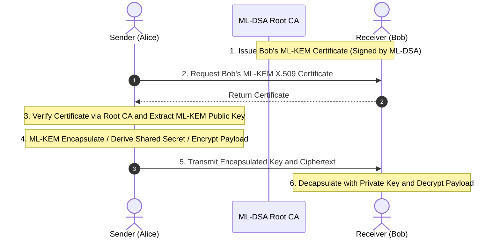

# 04. PQC X.509 PKI & End-to-End Encryption

## 📌 Overview
In a post-quantum public key infrastructure (PKI), **ML-DSA (FIPS 204)** is used for identity verification and digital certificate signing, while **ML-KEM (FIPS 203)** certificates distribute public keys for confidential communications. This section covers pure-PQC X.509 certificate authority hierarchies and E2E encrypted communication pipelines.

---

## 🔍 Planned Topics (Phase 4)
- Automated PKI issuance scripts via OpenSSL 3.5 CLI (`run_pki.sh`)
- ML-DSA CA hierarchies and ML-KEM recipient certificate generation
- Rust and C++ X.509 parsing + HPKE E2E integration tests
