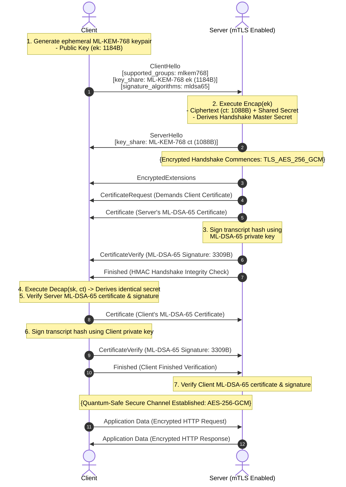

# 05. PQC TLS 1.3 / mTLS Hands-on

## 📌 Overview
TLS 1.3 is the bedrock protocol securing internet confidentiality and authenticity. To shield TLS 1.3 against quantum computer threats, both the **Key Exchange** and **Identity Authentication** layers must transition to Post-Quantum Cryptography (PQC):

1. **Key Exchange**: `ML-KEM-768` (or `X25519MLKEM768` hybrid) ➔ Defeats Harvest Now, Decrypt Later (HNDL) attacks
2. **Authentication / mTLS**: `ML-DSA-65` X.509 certificates and `CertificateVerify` digital signatures ➔ Defeats active impersonation and forgery

This chapter examines the full packet-level handshake architecture of pure PQC TLS 1.3 with mutual authentication (mTLS) in OpenSSL 3.5+, accompanied by runnable clients across 4 languages (Python, Rust, C++20, and OpenSSL CLI).



---

## 🔍 PQC TLS 1.3 Packet Overhead & Network Sizing

Because PQC cryptographic keys and signatures are larger than classical ECC equivalents, evaluating packet size implications against standard MTU (1,500 bytes) boundaries is critical:

| Handshake Component | Classical TLS 1.3 (ECDH + ECDSA) | PQC TLS 1.3 (ML-KEM-768 + ML-DSA-65) | Size Factor |
| :--- | :--- | :--- | :--- |
| **Client Key Share (Public Key)** | X25519: **32 bytes** | ML-KEM-768: **1,184 bytes** | ~37x |
| **Server Key Share (Ciphertext)** | X25519: **32 bytes** | ML-KEM-768: **1,088 bytes** | ~34x |
| **Certificate Signature (CertificateVerify)** | ECDSA P-256: **64 bytes** | ML-DSA-65: **3,309 bytes** | ~51x |
| **Ethernet MTU (1,500B) Fit** |  Fits in single frame | ⚠️ `CertificateVerify` triggers TCP segmentation | Requires multi-segment reassembly |

> **💡 Network Engineering Recommendation:**<br>
> Both `ClientHello` and `ServerHello` `key_share` payloads (1,184B and 1,088B) fit cleanly inside standard 1,500B Ethernet MTUs without packet fragmentation. However, during the authentication phase, the `ML-DSA-65` signature (3,309B) naturally triggers TCP segmentation. Socket receive/send buffers (`SO_RCVBUF`/`SO_SNDBUF`) should be sized to at least 64KB.

---

## 💻 Runnable Multi-Language Client Implementations

The tabs below demonstrate connecting to an OpenSSL 3.5 PQC TLS 1.3 mTLS server, performing mutual authentication, and transmitting encrypted application data across 4 languages:

=== "Python"

    ```python
    # Python 3 - OpenSSL 3.5 PQC TLS 1.3 / mTLS Client
    import subprocess
    import sys

    certs_dir = "/tmp/pqc_tls_certs"
    port = "14433"

    cmd = [
        "openssl", "s_client",
        "-connect", f"127.0.0.1:{port}",
        "-cert", f"{certs_dir}/client.crt",
        "-key", f"{certs_dir}/client.key",
        "-CAfile", f"{certs_dir}/ca.crt",
        "-groups", "mlkem768",
        "-tls1_3",
        "-verify_return_error",
    ]

    proc = subprocess.Popen(cmd, stdin=subprocess.PIPE, stdout=subprocess.PIPE, stderr=subprocess.PIPE, text=True)
    stdout, stderr = proc.communicate(input="GET / HTTP/1.0

")
    output = stdout + stderr

    assert "TLSv1.3" in output
    assert "Peer signature type: mldsa65" in output
    assert "Verify return code: 0 (ok)" in output
    print("[PASS] Python PQC TLS 1.3 mTLS Client verified successfully!")
    ```

=== "Rust"

    ```rust
    // Rust 2021/2024 Edition - PQC TLS 1.3 / mTLS Client
    use openssl::ssl::{SslConnector, SslMethod, SslFiletype, SslVerifyMode};
    use std::net::TcpStream;
    use std::io::{Read, Write};

    fn main() -> Result<(), Box<dyn std::error::Error>> {
        let mut builder = SslConnector::builder(SslMethod::tls_client())?;
        builder.set_ca_file("/tmp/pqc_tls_certs/ca.crt")?;
        builder.set_certificate_file("/tmp/pqc_tls_certs/client.crt", SslFiletype::PEM)?;
        builder.set_private_key_file("/tmp/pqc_tls_certs/client.key", SslFiletype::PEM)?;
        builder.set_verify(SslVerifyMode::PEER);
        builder.set_groups_list("mlkem768")?;

        let connector = builder.build();
        let stream = TcpStream::connect("127.0.0.1:14433")?;
        let mut ssl_stream = connector.connect("127.0.0.1", stream)?;

        println!("[PASS] Rust TLS 1.3 Connected: version={:?}, cipher={:?}",
                 ssl_stream.ssl().version_str(),
                 ssl_stream.ssl().current_cipher().map(|c| c.name()));

        ssl_stream.write_all(b"GET / HTTP/1.0

")?;
        let mut buf = [0u8; 1024];
        let bytes = ssl_stream.read(&mut buf)?;
        assert!(bytes > 0);
        println!("[PASS] Rust PQC mTLS Data Exchange Succeeded!");
        Ok(())
    }
    ```

=== "C++"

    ```cpp
    // C++20 - OpenSSL 3.5 Native PQC TLS 1.3 / mTLS Client
    #include <iostream>
    #include <memory>
    #include <cassert>
    #include <unistd.h>
    #include <sys/socket.h>
    #include <netinet/in.h>
    #include <arpa/inet.h>
    #include <openssl/ssl.h>

    struct SslCtxDeleter { void operator()(SSL_CTX* p) const { if (p) SSL_CTX_free(p); } };
    struct SslDeleter { void operator()(SSL* p) const { if (p) { SSL_shutdown(p); SSL_free(p); } } };

    int main() {
        std::unique_ptr<SSL_CTX, SslCtxDeleter> ctx(SSL_CTX_new(TLS_client_method()));
        SSL_CTX_set_min_proto_version(ctx.get(), TLS1_3_VERSION);
        SSL_CTX_set_max_proto_version(ctx.get(), TLS1_3_VERSION);
        SSL_CTX_set1_groups_list(ctx.get(), "mlkem768");

        SSL_CTX_load_verify_locations(ctx.get(), "/tmp/pqc_tls_certs/ca.crt", nullptr);
        SSL_CTX_set_verify(ctx.get(), SSL_VERIFY_PEER, nullptr);
        SSL_CTX_use_certificate_file(ctx.get(), "/tmp/pqc_tls_certs/client.crt", SSL_FILETYPE_PEM);
        SSL_CTX_use_PrivateKey_file(ctx.get(), "/tmp/pqc_tls_certs/client.key", SSL_FILETYPE_PEM);

        int sock = socket(AF_INET, SOCK_STREAM, 0);
        struct sockaddr_in server_addr{};
        server_addr.sin_family = AF_INET;
        server_addr.sin_port = htons(14433);
        inet_pton(AF_INET, "127.0.0.1", &server_addr.sin_addr);
        connect(sock, (struct sockaddr*)&server_addr, sizeof(server_addr));

        std::unique_ptr<SSL, SslDeleter> ssl(SSL_new(ctx.get()));
        SSL_set_fd(ssl.get(), sock);
        SSL_set_tlsext_host_name(ssl.get(), "127.0.0.1");
        assert(SSL_connect(ssl.get()) > 0);

        std::cout << "[PASS] C++ TLS 1.3 Connected: " << SSL_get_version(ssl.get()) << std::endl;
        const char* req = "GET / HTTP/1.0

";
        SSL_write(ssl.get(), req, strlen(req));
        char buf[1024] = {0};
        assert(SSL_read(ssl.get(), buf, sizeof(buf) - 1) > 0);
        std::cout << "[PASS] C++ PQC mTLS Data Exchange Succeeded!" << std::endl;

        close(sock);
        return 0;
    }
    ```

=== "OpenSSL CLI"

    ```bash
    # OpenSSL 3.5 CLI PQC TLS 1.3 mTLS Server & Client

    # 1. Launch mTLS server (ML-KEM-768 key exchange + ML-DSA-65 mutual auth)
    openssl s_server -accept 14433         -cert server.crt -key server.key -CAfile ca.crt         -Verify 1 -groups mlkem768 -tls1_3 -www &

    # 2. Connect client and mutually authenticate
    echo "GET / HTTP/1.0" | openssl s_client -connect 127.0.0.1:14433         -cert client.crt -key client.key -CAfile ca.crt         -groups mlkem768 -tls1_3 -verify_return_error
    ```
