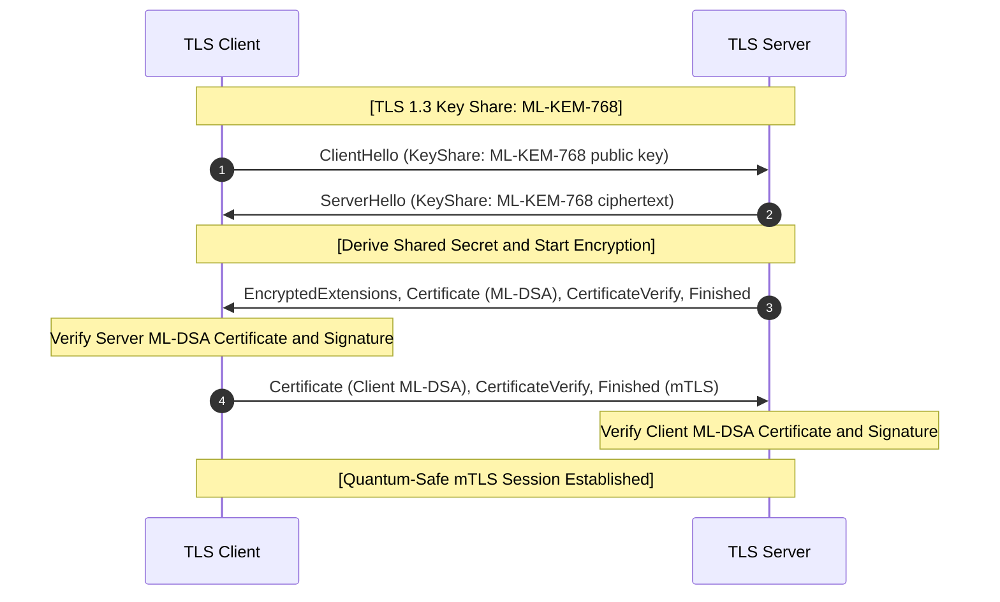

# 05. PQC TLS 1.3 / mTLS Hands-on

## 📌 Overview
In a post-quantum TLS 1.3 handshake, key exchange is achieved via **ML-KEM**, while server and client authentication (mTLS) is secured via **ML-DSA** digital signatures. This section demonstrates native PQC TLS 1.3 connection establishment and mutual TLS verification using OpenSSL 3.5+.

---

## 🔍 Planned Topics (Phase 5)
- Detailed packet structures and cryptographic mappings in PQC TLS 1.3 handshakes
- OpenSSL 3.5 `s_server` / `s_client` automation for ML-DSA + ML-KEM mTLS
- Automated E2E verification test harness
