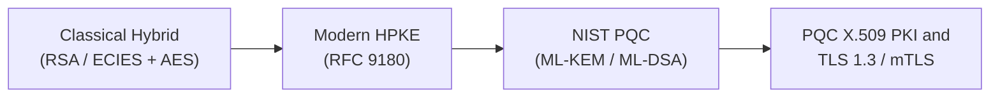

# Applied PQC Lab

**Applied PQC Lab** is a practical engineering lab and documentation site designed to visually explore and practically verify modern applied cryptography—from classical hybrid encryption to RFC 9180 HPKE, NIST standardized Post-Quantum Cryptography (PQC: FIPS 203/204), X.509 PKI, and TLS 1.3/mTLS.

---

## 🎯 Key Objectives



1. **Visual-First Architecture**: Clear understanding of cryptographic primitives via Mermaid diagrams and data flowcharts rather than abstract math formulas.
2. **Verified Multi-Language Implementations**: Complete E2E runnable examples in C++20, Rust, and OpenSSL 3.5+ CLI.
3. **Reproducible Isolation (Docker-Based)**: Fully isolated, zero-host-pollution execution in reproducible Docker containers.

---

## 📚 Roadmap Overview

| Section | Topic | Key Highlights |
| :--- | :--- | :--- |
| **01. Classical Hybrid** | Classical Hybrid Encryption | Structure and limitations of RSA / ECIES key wrapping |
| **02. Modern HPKE** | RFC 9180 HPKE | Modular KEM + KDF + AEAD architecture & Base Mode |
| **03. PQC Primitives** | NIST Standardized PQC | FIPS 203 ML-KEM (formerly Kyber) & FIPS 204 ML-DSA (formerly Dilithium) |
| **04. PQC PKI & X.509** | Post-Quantum PKI | ML-DSA Root CA issuance and ML-KEM recipient certificates |
| **05. PQC TLS & mTLS** | PQC TLS 1.3 Hands-on | OpenSSL 3.5 native ML-DSA / ML-KEM mutual TLS authentication |

---

## 🚀 Quick Start Example (Preview)

Below is an example of the standard multi-language tab layout and collapsible deep dive block:

=== "Rust"

    ```rust
    // Rust 2021 Example
    fn main() {
        println!("Welcome to Applied PQC Lab!");
    }
    ```

=== "C++"

    ```cpp
    // C++20 Example
    #include <iostream>

    int main() {
        std::cout << "Welcome to Applied PQC Lab!
";
        return 0;
    }
    ```

=== "OpenSSL CLI"

    ```bash
    # OpenSSL 3.5 CLI Example
    openssl version
    ```

??? note "Mathematical Deep Dive (Foldable)"

    In-depth mathematical proofs or lattice-based polynomial ring operations are isolated within foldable blocks to maintain reading flow and visual clarity.

    $$R_q = \mathbb{Z}_q[X] / (X^n + 1)$$
