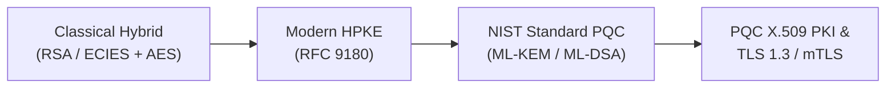

# Applied PQC Lab

**Applied PQC Lab** is a hands-on engineering lab for analyzing and verifying modern applied cryptographic mechanisms—from Classical Hybrid Encryption to RFC 9180 HPKE, NIST standardized Post-Quantum Cryptography (PQC: FIPS 203/204), X.509 PKI, and TLS 1.3 / mTLS.

---

## 🎯 Core Objectives



1. **Visual-First & Intuitive**: Understand underlying mechanics via Mermaid sequence/flowchart diagrams and clear data flows instead of complex math.
2. **4 Multi-Language Implementation Tabs**: Complete, runnable E2E code in Python 3, Rust, C++20, and OpenSSL 3.5+ CLI.
3. **Docker-Based Reproducibility**: Zero host pollution with fully reproducible containerized verification.

---

## 📚 Roadmap Overview

| Chapter                  | Topic                           | Key Focus                                                            |
| :----------------------- | :------------------------------ | :------------------------------------------------------------------- |
| **01. Classical Hybrid** | Classical Hybrid Encryption     | RSA / ECIES Key Wrapping architecture and vulnerabilities            |
| **02. Modern HPKE**      | RFC 9180 HPKE                   | Modular KEM + KDF + AEAD framework and Base mode operations          |
| **03. PQC Primitives**   | NIST Standardized PQC           | FIPS 203 ML-KEM and FIPS 204 ML-DSA                                  |
| **04. PQC PKI & X.509**  | Post-Quantum PKI Infrastructure | ML-DSA Root CA certificate issuance and ML-KEM recipient integration |
| **05. PQC TLS & mTLS**   | PQC TLS 1.3 Hands-on            | OpenSSL 3.5 native ML-DSA / ML-KEM mutual TLS authentication         |

---

## 🚀 Quick Preview (4 Multi-Language Tabs)

=== "Python"

    ```python
    # Python 3 Example
    print("Welcome to Applied PQC Lab!")
    ```

=== "Rust"

    ```rust
    // Rust 2021 Example
    fn main() {
        println!("Welcome to Applied PQC Lab!");
    }
    ```

=== "C++"

    ```cpp
    // C++20 Example
    #include <iostream>

    int main() {
        std::cout << "Welcome to Applied PQC Lab!" << std::endl;
        return 0;
    }
    ```

=== "OpenSSL CLI"

    ```bash
    # OpenSSL 3.5 CLI Example
    openssl version
    ```
