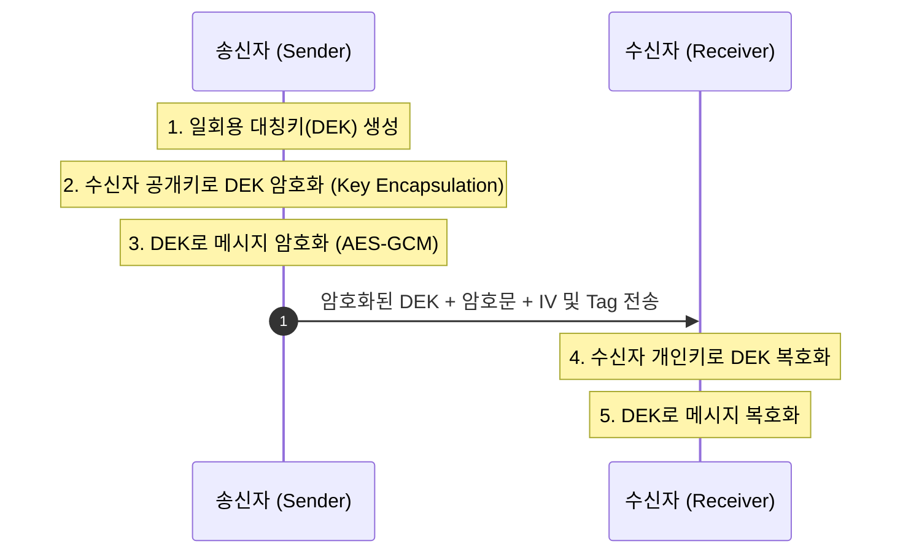

# 01. 고전 하이브리드 암호 (Classical Hybrid Encryption)

## 📌 개요
고전 하이브리드 암호 방식은 비대칭 암호(RSA, ECIES)를 이용해 임의로 생성된 대칭키(Data Encryption Key, DEK)를 래핑(Wrapping)하고, 실제 대용량 데이터는 빠른 대칭키 암호(AES-GCM, ChaCha20-Poly1305)로 암호화하는 전통적인 기법입니다.

---

## 🔍 향후 실습 내용 (Phase 2 예정)
- RSA-OAEP / ECIES 키 래핑 구조의 메커니즘
- KEM 형태와의 차이점 및 고전 하이브리드 암호의 한계점
- Rust 및 C++ 기반 비교 실습 코드
