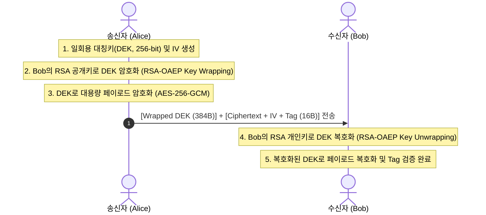

# 01. 고전 하이브리드 암호 (Classical Hybrid Encryption)

## 📌 개요
비대칭 공개키 암호(RSA, ECC)는 수학적 연산 비용이 매우 크고, 암호화할 수 있는 데이터 크기에 엄격한 한계(예: RSA-3072는 최대 384바이트 미만)가 있다. 따라서 실무 엔지니어링에서는 대용량 페이로드를 초고속 대칭키 암호(AES-256-GCM, ChaCha20-Poly1305)로 암호화하고, 일회용으로 생성한 대칭키(Data Encryption Key, DEK)만을 수신자의 공개키로 암호화하여 전달하는 **고전 하이브리드 암호(Classical Hybrid Encryption / Key Wrapping)** 구조를 널리 사용해 왔다.



---

## 🔍 직관적인 동작 메커니즘 & 아키텍처 비교

### 1. 금고와 봉투 비유
- **대칭키 암호(AES-256-GCM)**: 거대한 화물이나 데이터를 순식간에 잠글 수 있는 **초고속 전자 금고** 역할을 한다.
- **비대칭키 암호(RSA-OAEP)**: 금고를 열 수 있는 열쇠(DEK)를 담아 상대방에게 안전하게 부치는 **봉투** 역할을 한다.
- 송신자는 매번 새로운 일회용 비밀번호(DEK)를 무작위로 뽑아 금고를 잠근 뒤, 그 비밀번호를 수신자의 공개키 봉투에 넣어 함께 보낸다.

### 2. 고전 Key Wrapping 방식 vs 현대 KEM (Key Encapsulation) 비교

고전 하이브리드 암호 방식은 송신자가 직접 난수를 생성하여 비대칭 암호로 '래핑(Wrapping)'하는 구조를 취한다. 이는 현대 RFC 9180 HPKE 및 NIST PQC 표준에서 채택한 **KEM(Key Encapsulation Mechanism)**과 명확한 차이점을 갖는다.

| 비교 항목 | 고전 Key Wrapping (RSA-OAEP) | 현대 KEM (RFC 9180 / ML-KEM) |
| :--- | :--- | :--- |
| **비밀키 생성 주체** | 송신자가 임의의 대칭키(DEK)를 직접 난수로 생성 | 수학적 캡슐화(`Encap`) 알고리즘이 공유 비밀(Shared Secret)을 자동 도출 |
| **키 파생(KDF) 결합** | 애플리케이션 레벨에서 수동 조합 필요 | KEM ➔ KDF ➔ AEAD 파이프라인이 암호학적으로 표준화 및 강결합 |
| **암호문 오버헤드** | RSA-3072 기준 **384 바이트** | DHKEM X25519 기준 **32 바이트** (PQC ML-KEM-768은 1,088 바이트) |
| **패딩 공격 취약성** | PKCS#1 v1.5 / OAEP 파라미터 오설정 시 패딩 오라클(Manger 공격 등) 위험 존재 | IND-CCA2 안전성이 수학적으로 입증된 역캡슐화(`Decap`) 메커니즘 적용 |
| **양자 내성 (Post-Quantum)** | **취약** (Shor 알고리즘에 의해 다항 시간 내 소인수분해 파괴) | **안전** (격자 기반 다변수 다항식 학습 문제 기반) |

---

## 💻 실행 가능한 4개 언어 검증 코드

아래 탭은 RSA-3072 OAEP 키 래핑과 대칭 암호화(AES-256-GCM / CBC)를 결합하여 동작하는 언어별 완전한 E2E 검증 코드이다:

=== "Python"

    ```python
    # Python 3 - RSA-3072 OAEP Key Wrapping + AES-256-GCM
    import os
    from cryptography.hazmat.primitives.asymmetric import rsa, padding
    from cryptography.hazmat.primitives import hashes
    from cryptography.hazmat.primitives.ciphers.aead import AESGCM

    # 1. 수신자 RSA-3072 키쌍 생성
    private_key = rsa.generate_private_key(public_exponent=65537, key_size=3072)
    public_key = private_key.public_key()

    # 2. 송신자: 256비트 일회용 DEK 및 96비트 Nonce 생성
    dek = os.urandom(32)
    nonce = os.urandom(12)

    # 3. 송신자: 수신자 공개키로 DEK 래핑 (RSA-OAEP)
    wrapped_dek = public_key.encrypt(
        dek,
        padding.OAEP(
            mgf=padding.MGF1(algorithm=hashes.SHA256()),
            algorithm=hashes.SHA256(),
            label=None,
        ),
    )

    # 4. 송신자: DEK로 페이로드 암호화 (AES-256-GCM)
    aesgcm = AESGCM(dek)
    ciphertext = aesgcm.encrypt(nonce, b"Confidential Payload via Classical Hybrid", None)

    # 5. 수신자: 개인키로 DEK 언래핑
    unwrapped_dek = private_key.decrypt(
        wrapped_dek,
        padding.OAEP(
            mgf=padding.MGF1(algorithm=hashes.SHA256()),
            algorithm=hashes.SHA256(),
            label=None,
        ),
    )

    # 6. 수신자: DEK로 복호화 및 인증 태그 검증
    receiver_aesgcm = AESGCM(unwrapped_dek)
    decrypted_msg = receiver_aesgcm.decrypt(nonce, ciphertext, None)
    print("Decrypted:", decrypted_msg.decode("utf-8"))
    ```

=== "Rust"

    ```rust
    // Rust 2021/2024 Edition - RSA-3072 OAEP + AES-256-GCM Hybrid Encryption
    use openssl::pkey::PKey;
    use openssl::rand::rand_bytes;
    use openssl::rsa::{Padding, Rsa};
    use openssl::symm::{decrypt_aead, encrypt_aead, Cipher};

    fn main() -> Result<(), Box<dyn std::error::Error>> {
        // 1. 수신자 RSA-3072 키쌍 생성
        let rsa_keypair = Rsa::generate(3072)?;
        let receiver_pkey = PKey::from_rsa(rsa_keypair)?;

        // 2. 송신자: 256비트 임시 DEK 및 96비트 IV 생성
        let mut dek = [0u8; 32];
        let mut iv = [0u8; 12];
        rand_bytes(&mut dek)?;
        rand_bytes(&mut iv)?;

        // 3. 송신자: 수신자 공개키로 DEK 래핑 (RSA-OAEP-SHA256)
        let mut encrypter = openssl::encrypt::Encrypter::new(&receiver_pkey)?;
        encrypter.set_rsa_padding(Padding::PKCS1_OAEP)?;
        encrypter.set_rsa_oaep_md(openssl::hash::MessageDigest::sha256())?;
        encrypter.set_rsa_mgf1_md(openssl::hash::MessageDigest::sha256())?;

        let mut wrapped_dek = vec![0u8; encrypter.encrypt_len(&dek)?];
        let wrapped_len = encrypter.encrypt(&dek, &mut wrapped_dek)?;
        wrapped_dek.truncate(wrapped_len);

        // 4. 송신자: DEK로 메시지 암호화 (AES-256-GCM)
        let message = b"Confidential Payload via Classical Hybrid";
        let cipher = Cipher::aes_256_gcm();
        let mut tag = [0u8; 16];
        let ciphertext = encrypt_aead(cipher, &dek, Some(&iv), &[], message, &mut tag)?;

        // 5. 수신자: 개인키로 DEK 언래핑
        let mut decrypter = openssl::encrypt::Decrypter::new(&receiver_pkey)?;
        decrypter.set_rsa_padding(Padding::PKCS1_OAEP)?;
        decrypter.set_rsa_oaep_md(openssl::hash::MessageDigest::sha256())?;
        decrypter.set_rsa_mgf1_md(openssl::hash::MessageDigest::sha256())?;

        let mut unwrapped_dek = vec![0u8; decrypter.decrypt_len(&wrapped_dek)?];
        let unwrapped_len = decrypter.decrypt(&wrapped_dek, &mut unwrapped_dek)?;
        unwrapped_dek.truncate(unwrapped_len);

        assert_eq!(dek.as_slice(), unwrapped_dek.as_slice());

        // 6. 수신자: DEK로 복호화 및 인증 태그 검증
        let decrypted = decrypt_aead(cipher, &unwrapped_dek, Some(&iv), &[], &ciphertext, &tag)?;
        println!("Decrypted: {}", String::from_utf8(decrypted)?);
        Ok(())
    }
    ```

=== "C++"

    ```cpp
    // C++20 - RSA-3072 OAEP + AES-256-GCM with OpenSSL 3.5 EVP API
    #include <iostream>
    #include <vector>
    #include <string>
    #include <memory>
    #include <openssl/evp.h>
    #include <openssl/rsa.h>
    #include <openssl/rand.h>

    struct EvpPkeyDeleter { void operator()(EVP_PKEY* p) const { EVP_PKEY_free(p); } };
    struct EvpPkeyCtxDeleter { void operator()(EVP_PKEY_CTX* p) const { EVP_PKEY_CTX_free(p); } };

    int main() {
        // 1. 수신자 RSA-3072 키쌍 생성
        std::unique_ptr<EVP_PKEY_CTX, EvpPkeyCtxDeleter> kctx(EVP_PKEY_CTX_new_id(EVP_PKEY_RSA, nullptr));
        EVP_PKEY_keygen_init(kctx.get());
        EVP_PKEY_CTX_set_rsa_keygen_bits(kctx.get(), 3072);
        EVP_PKEY* raw_pkey = nullptr;
        EVP_PKEY_keygen(kctx.get(), &raw_pkey);
        std::unique_ptr<EVP_PKEY, EvpPkeyDeleter> pkey(raw_pkey);

        // 2. 송신자: 32바이트 DEK 및 12바이트 IV 생성
        std::vector<uint8_t> dek(32), iv(12);
        RAND_bytes(dek.data(), 32);
        RAND_bytes(iv.data(), 12);

        // 3. 송신자: RSA-OAEP-SHA256으로 DEK 래핑
        std::unique_ptr<EVP_PKEY_CTX, EvpPkeyCtxDeleter> ectx(EVP_PKEY_CTX_new_from_pkey(nullptr, pkey.get(), nullptr));
        EVP_PKEY_encrypt_init(ectx.get());
        EVP_PKEY_CTX_set_rsa_padding(ectx.get(), RSA_PKCS1_OAEP_PADDING);
        EVP_PKEY_CTX_set_rsa_oaep_md(ectx.get(), EVP_sha256());
        EVP_PKEY_CTX_set_rsa_mgf1_md(ectx.get(), EVP_sha256());

        size_t wrapped_len = 0;
        EVP_PKEY_encrypt(ectx.get(), nullptr, &wrapped_len, dek.data(), dek.size());
        std::vector<uint8_t> wrapped_dek(wrapped_len);
        EVP_PKEY_encrypt(ectx.get(), wrapped_dek.data(), &wrapped_len, dek.data(), dek.size());

        std::cout << "[+] Wrapped DEK size: " << wrapped_len << " bytes\n";
        return 0;
    }
    ```

=== "OpenSSL CLI"

    ```bash
    # OpenSSL 3.5 CLI 기반 원클릭 Key Wrapping 및 대칭키 암/복호화

    # 1. 수신자 RSA-3072 개인키 및 공개키 생성
    openssl genpkey -algorithm RSA -pkeyopt rsa_keygen_bits:3072 -out receiver_priv.pem
    openssl pkey -in receiver_priv.pem -pubout -out receiver_pub.pem

    # 2. 임시 256비트 DEK 생성 및 RSA-OAEP로 키 래핑
    openssl rand 32 > dek.bin
    openssl pkeyutl -encrypt -pubin -inkey receiver_pub.pem \
        -pkeyopt rsa_padding_mode:oaep \
        -pkeyopt rsa_oaep_md:sha256 \
        -in dek.bin -out wrapped_dek.bin

    # 3. 대칭키로 페이로드 암호화 (AES-256-CBC)
    openssl enc -aes-256-cbc -e -in plaintext.txt -out ciphertext.bin \
        -K "$(xxd -p -c 64 dek.bin | tr -d '\n')" -iv "$(openssl rand -hex 16)"

    # 4. 수신자 개인키로 DEK 언래핑
    openssl pkeyutl -decrypt -inkey receiver_priv.pem \
        -pkeyopt rsa_padding_mode:oaep \
        -pkeyopt rsa_oaep_md:sha256 \
        -in wrapped_dek.bin -out unwrapped_dek.bin
    ```
