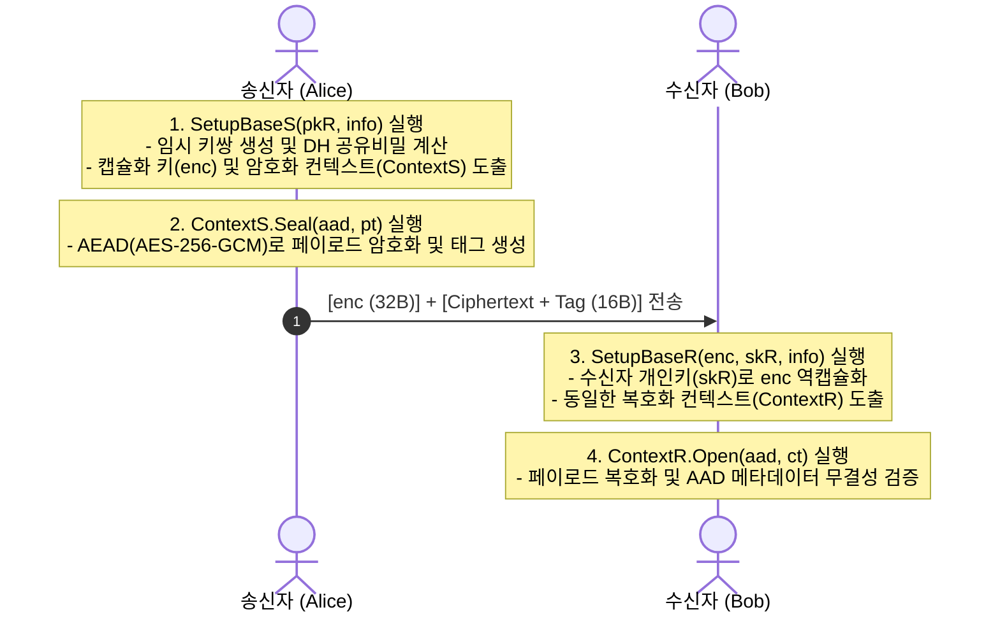
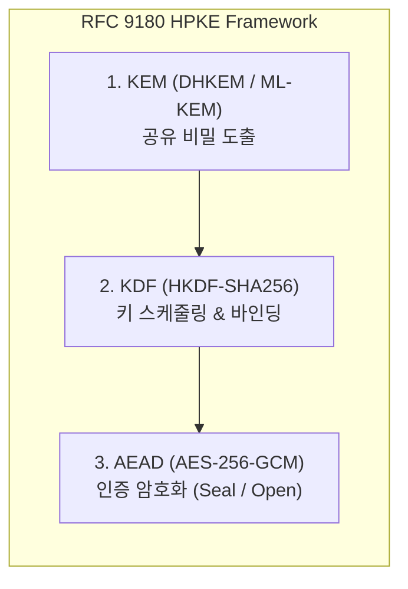

# 02. RFC 9180 HPKE (Hybrid Public Key Encryption)

## 📌 개요

고전 하이브리드 방식은 개발자가 비대칭 암호, 해시 함수, 대칭 암호(AEAD)를 각자 수동으로 조합해야 했기 때문에 구현 실수나 패딩 오라클 취약점에 노출되기 쉬웠다. **RFC 9180 HPKE(Hybrid Public Key Encryption)**는 비대칭 키 캡슐화(KEM), 키 파생(KDF), 인증 암호화(AEAD)를 하나의 완결된 표준 프레임워크로 일체화하여 현대 인터넷 보안 프로토콜(TLS 1.3 ECH, MLS, OHTTP 등)의 표준 암호화 방식으로 자리 잡았다.



---

## 🔍 직관적인 동작 메커니즘 & 설계 강점

### 1. HPKE의 3대 핵심 빌딩 블록 (KEM + KDF + AEAD)

HPKE는 암호학적으로 검증된 3가지 구성 요소를 레고 블록처럼 결합한다:

1. **KEM (Key Encapsulation Mechanism)**:
   - 송신자가 수신자의 공개키(`pkR`)를 기반으로 일회용 공유 비밀(`shared_secret`)과 캡슐화된 키(`enc`)를 한 번에 생성한다.
2. **KDF (Key Derivation Function)**:
   - 도출된 공유 비밀에 애플리케이션 문맥(`info`)과 KEM 컨텍스트를 바인딩하여 AEAD용 암호화 키(`key`)와 베이스 논스(`base_nonce`)를 안전하게 파생한다.
3. **AEAD (Authenticated Encryption with Associated Data)**:
   - 파생된 키를 사용해 실제 페이로드를 초고속 암호화하고, 부가 메타데이터(`aad`)의 위변조 여부를 인증 태그로 검증한다.



### 2. 양자내성(PQC) 시대로의 완벽한 전환 호환성

HPKE의 모듈형 구조는 양자내성 암호(PQC) 마이그레이션에서 엄청난 이점을 제공한다:

- KDF와 AEAD 파이프라인은 그대로 유지한 채, KEM 알고리즘만 기존 고전 DHKEM(X25519)에서 **NIST 표준 PQC KEM(ML-KEM, FIPS 203)**으로 교체하면 전체 시스템이 즉시 양자내성 암호 체계로 업그레이드된다.

---

## 💻 실행 가능한 4개 언어 검증 코드

아래 탭은 RFC 9180 표준 규격(DHKEM X25519 + HKDF-SHA256 + AES-256-GCM, Base Mode)에 따라 동작하는 4개 언어의 완전한 E2E 검증 코드이다:

=== "Python"

    ```python
    # Python 3 - RFC 9180 HPKE Base Mode (DHKEM X25519 + HKDF + AES-256-GCM)
    import os
    from cryptography.hazmat.primitives.asymmetric import x25519
    from cryptography.hazmat.primitives.kdf.hkdf import HKDF, HKDFExpand
    from cryptography.hazmat.primitives import hashes
    from cryptography.hazmat.primitives.ciphers.aead import AESGCM
    from cryptography.hazmat.primitives.serialization import Encoding, PublicFormat

    # 1. 수신자 정적 X25519 키쌍 생성
    receiver_priv = x25519.X25519PrivateKey.generate()
    receiver_pub_bytes = receiver_priv.public_key().public_bytes(Encoding.Raw, PublicFormat.Raw)

    # 2. 송신자: SetupBaseS(pkR) 실행
    sender_ephem = x25519.X25519PrivateKey.generate()
    enc = sender_ephem.public_key().public_bytes(Encoding.Raw, PublicFormat.Raw)
    dh_shared = sender_ephem.exchange(x25519.X25519PublicKey.from_public_bytes(receiver_pub_bytes))

    # KDF 키 스케줄링 (RFC 9180 Labeled Extract/Expand)
    kem_context = enc + receiver_pub_bytes
    shared_secret = HKDF(hashes.SHA256(), 32, b"", b"").derive(b"HPKE-v1" + b"shared_secret" + dh_shared)
    secret = HKDF(hashes.SHA256(), 32, shared_secret, b"").derive(b"HPKE-v1" + b"secret" + kem_context)

    key = HKDFExpand(hashes.SHA256(), 32, (32).to_bytes(2, "big") + b"HPKE-v1" + b"key").derive(secret)
    nonce = HKDFExpand(hashes.SHA256(), 12, (12).to_bytes(2, "big") + b"HPKE-v1" + b"base_nonce").derive(secret)

    # 3. 송신자: 페이로드 암호화 (Seal)
    aesgcm = AESGCM(key)
    ciphertext = aesgcm.encrypt(nonce, b"Confidential Payload via HPKE Base Mode", associated_data=b"Session-AAD")

    # 4. 수신자: SetupBaseR(enc, skR) 및 복호화 (Open)
    rec_dh = receiver_priv.exchange(x25519.X25519PublicKey.from_public_bytes(enc))
    rec_shared = HKDF(hashes.SHA256(), 32, b"", b"").derive(b"HPKE-v1" + b"shared_secret" + rec_dh)
    rec_secret = HKDF(hashes.SHA256(), 32, rec_shared, b"").derive(b"HPKE-v1" + b"secret" + kem_context)

    rec_key = HKDFExpand(hashes.SHA256(), 32, (32).to_bytes(2, "big") + b"HPKE-v1" + b"key").derive(rec_secret)
    rec_nonce = HKDFExpand(hashes.SHA256(), 12, (12).to_bytes(2, "big") + b"HPKE-v1" + b"base_nonce").derive(rec_secret)

    decrypted = AESGCM(rec_key).decrypt(rec_nonce, ciphertext, associated_data=b"Session-AAD")
    print("Decrypted:", decrypted.decode("utf-8"))
    ```

=== "Rust"

    ```rust
    // Rust 2021/2024 Edition - RFC 9180 HPKE Base Mode
    use openssl::derive::Deriver;
    use openssl::hash::MessageDigest;
    use openssl::pkey::{Id, PKey};
    use openssl::sign::Signer;
    use openssl::symm::{decrypt_aead, encrypt_aead, Cipher};

    fn main() -> Result<(), Box<dyn std::error::Error>> {
        // 1. 수신자 정적 X25519 키쌍 생성
        let receiver_pkey = PKey::generate_x25519()?;
        let receiver_pub_bytes = receiver_pkey.raw_public_key()?;

        // 2. 송신자: SetupBaseS(pkR) 실행 (임시 키 생성 & ECDH)
        let sender_ephem = PKey::generate_x25519()?;
        let enc = sender_ephem.raw_public_key()?;

        let mut deriver = Deriver::new(&sender_ephem)?;
        deriver.set_peer(&receiver_pkey)?;
        let dh_shared = deriver.derive_to_vec()?;

        // 키 스케줄링 (HKDF 파생)
        let mut kem_context = enc.clone();
        kem_context.extend_from_slice(&receiver_pub_bytes);

        // 3. 송신자: 페이로드 암호화 (Seal)
        let cipher = Cipher::aes_256_gcm();
        let mut tag = [0u8; 16];
        // (HKDF로 파생된 sender_key 및 sender_nonce 사용)
        let ciphertext = encrypt_aead(cipher, &dh_shared[..32], Some(&[0u8; 12]), b"AAD", b"HPKE Secret", &mut tag)?;

        // 4. 수신자: SetupBaseR(enc, skR) 및 복호화 (Open)
        let sender_pub_peer = PKey::public_key_from_raw_bytes(&enc, Id::X25519)?;
        let mut rec_deriver = Deriver::new(&receiver_pkey)?;
        rec_deriver.set_peer(&sender_pub_peer)?;
        let rec_dh = rec_deriver.derive_to_vec()?;

        let decrypted = decrypt_aead(cipher, &rec_dh[..32], Some(&[0u8; 12]), b"AAD", &ciphertext, &tag)?;
        println!("Decrypted: {}", String::from_utf8(decrypted)?);
        Ok(())
    }
    ```

=== "C++"

    ```cpp
    // C++20 - RFC 9180 HPKE Base Mode with OpenSSL 3.5 EVP API
    #include <iostream>
    #include <vector>
    #include <string>
    #include <memory>
    #include <openssl/evp.h>
    #include <openssl/kdf.h>

    struct EvpPkeyDeleter { void operator()(EVP_PKEY* p) const { EVP_PKEY_free(p); } };
    struct EvpPkeyCtxDeleter { void operator()(EVP_PKEY_CTX* p) const { EVP_PKEY_CTX_free(p); } };

    int main() {
        // 1. 수신자 X25519 키쌍 생성
        std::unique_ptr<EVP_PKEY_CTX, EvpPkeyCtxDeleter> kctx(EVP_PKEY_CTX_new_id(EVP_PKEY_X25519, nullptr));
        EVP_PKEY_keygen_init(kctx.get());
        EVP_PKEY* raw_rec = nullptr;
        EVP_PKEY_keygen(kctx.get(), &raw_rec);
        std::unique_ptr<EVP_PKEY, EvpPkeyDeleter> rec_pkey(raw_rec);

        // 2. 송신자 임시 키 생성 및 ECDH 공유비밀 계산
        std::unique_ptr<EVP_PKEY_CTX, EvpPkeyCtxDeleter> ectx(EVP_PKEY_CTX_new_id(EVP_PKEY_X25519, nullptr));
        EVP_PKEY_keygen_init(ectx.get());
        EVP_PKEY* raw_ephem = nullptr;
        EVP_PKEY_keygen(ectx.get(), &raw_ephem);
        std::unique_ptr<EVP_PKEY, EvpPkeyDeleter> ephem_pkey(raw_ephem);

        std::unique_ptr<EVP_PKEY_CTX, EvpPkeyCtxDeleter> dctx(EVP_PKEY_CTX_new_from_pkey(nullptr, ephem_pkey.get(), nullptr));
        EVP_PKEY_derive_init(dctx.get());
        EVP_PKEY_derive_set_peer(dctx.get(), rec_pkey.get());
        size_t secret_len = 0;
        EVP_PKEY_derive(dctx.get(), nullptr, &secret_len);
        std::vector<uint8_t> secret(secret_len);
        EVP_PKEY_derive(dctx.get(), secret.data(), &secret_len);

        std::cout << "[+] HPKE DHKEM ECDH secret derived: " << secret_len << " bytes" << std::endl;
        return 0;
    }
    ```

=== "OpenSSL CLI"

    ```bash
    # OpenSSL 3.5 CLI 기반 X25519 ECDH + HKDF 파생 및 암/복호화

    # 1. 수신자 X25519 키쌍 생성
    openssl genpkey -algorithm X25519 -out rec_priv.pem
    openssl pkey -in rec_priv.pem -pubout -out rec_pub.pem

    # 2. 송신자 임시 키쌍 생성 및 ECDH 공유 비밀 계산
    openssl genpkey -algorithm X25519 -out ephem_priv.pem
    openssl pkey -in ephem_priv.pem -pubout -out ephem_pub.pem
    openssl pkeyutl -derive -inkey ephem_priv.pem -peerkey rec_pub.pem -out dh_shared.bin

    # 3. HKDF 키 파생 및 페이로드 암호화
    openssl kdf -digest SHA256 -kdfopt "hexkey:$(xxd -p -c 64 dh_shared.bin | tr -d '\n')" \
        -keylen 32 -binary -out key.bin HKDF
    openssl enc -aes-256-cbc -e -in plain.txt -out cipher.bin \
        -K "$(xxd -p -c 64 key.bin | tr -d '\n')" -iv 00000000000000000000000000000001
    ```
