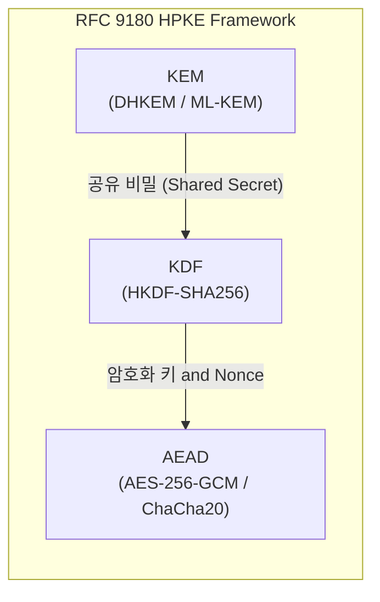

# 02. RFC 9180 HPKE (Hybrid Public Key Encryption)

## 📌 개요
RFC 9180 HPKE(Hybrid Public Key Encryption)는 공개키 기반 비대칭 암호와 대칭키 암호를 결합하는 방식을 표준화된 프레임워크로 정립한 현대 암호 표준이다. **KEM(Key Encapsulation Mechanism)**, **KDF(Key Derivation Function)**, **AEAD(Authenticated Encryption with Associated Data)** 세 가지 기본 프리미티브의 조합으로 구성된다.

---

## 🔍 주요 다룰 내용 (Phase 2 예정)
- HPKE의 4가지 동작 모드: Base, Auth, PSK, AuthPSK
- KEM 캡슐화(`Encap`) 및 역캡슐화(`Decap`) 시퀀스 분석
- OpenSSL 3.5 기반 C++20 및 Rust E2E 구현 예제
