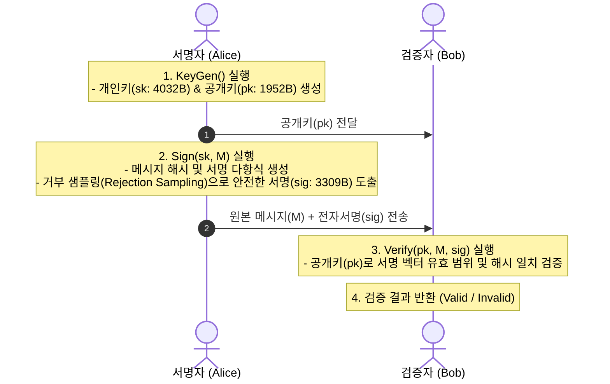
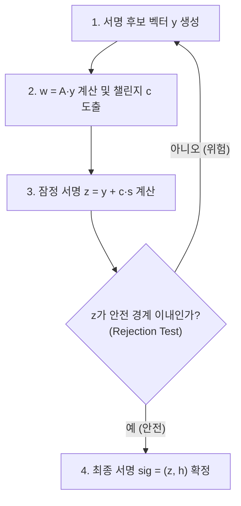

# 03-2. NIST FIPS 204 ML-DSA (Post-Quantum Digital Signatures)

## 📌 개요
양자 컴퓨터가 등장하면 인터넷 보안의 근간인 RSA 및 ECDSA 전자서명이 완전히 무력화된다. 이에 대응하여 NIST는 2024년 8월 격자 암호 기반의 공식 포스트 퀀텀 전자서명 표준 **FIPS 204 ML-DSA (Module-Lattice-Based Digital Signature Algorithm, 구 Dilithium)**를 제정했다.

본 문서에서는 **FIPS 204 ML-DSA**의 핵심 동작 원리(`KeyGen`, `Sign`, `Verify`)와 4개 언어(Python, Rust, C++20, OpenSSL 3.5+ CLI) 구현을 검증한다.



---

## 🔍 직관적인 동작 메커니즘 & 안전성 원리

### 1. 거부 샘플링 (Fiat-Shamir with Abort)
- **개인키 정보 유출 방지 메커니즘**:
  - 격자 서명에서 단순히 서명 벡터를 계산하면 서명값의 계수 분포가 비밀키 벡터(`sk`)와 상관관계를 갖게 되어 공격자가 여러 서명을 수집하여 비밀키를 역산할 수 있다.
  - ML-DSA는 서명 벡터가 특정 안전 경계 범위를 벗어날 경우 서명을 폐기하고 처음부터 다시 계산하는 **"거부 샘플링(Rejection Sampling)"**을 수행한다.
  - 이를 통해 최종 생성된 서명은 비밀키와 통계적으로 완전히 무관(Uniform Distribution)해져 양자 컴퓨터의 분석 공격을 원천 차단한다.



---

## 📊 FIPS 204 ML-DSA 파라미터 규격 비교

NIST는 요구 보안 강도에 따라 3가지 공식 파라미터 세트를 확정했다:

| 파라미터 규격 | 보안 강도 (NIST Category) | 공개키 크기 (pk) | 서명 크기 (sig) | 개인키 크기 (sk) | 권장 실무 적용 분야 |
| :--- | :--- | :--- | :--- | :--- | :--- |
| **ML-DSA-44** | Cat 2 (SHA-256 충돌 저항급) | 1,312 Bytes | 2,420 Bytes | 2,560 Bytes | 리소스 제한 환경 / 기본 보안 |
| **ML-DSA-65** | **Cat 3 (AES-192 동급)** | **1,952 Bytes** | **3,309 Bytes** | **4,032 Bytes** | **범용 표준 (X.509 CA & TLS 기본 권장)** |
| **ML-DSA-87** | Cat 5 (AES-256 동급) | 2,592 Bytes | 4,627 Bytes | 4,896 Bytes | 국가 안보 / 최장기 보존 전자문서 |

---

## 💻 실행 가능한 4개 언어 검증 코드

아래 탭은 OpenSSL 3.5+ 네이티브 FIPS 204 엔진을 연동한 4개 언어의 완전한 전자서명 생성 및 검증 코드이다:

=== "Python"

    ```python
    # Python 3 - OpenSSL 3.5+ 네이티브 FIPS 204 ML-DSA-65 서명 및 검증
    import ctypes
    from ctypes import c_void_p, c_char_p, c_size_t, POINTER, byref, create_string_buffer

    libcrypto = ctypes.CDLL("/opt/openssl/lib/libcrypto.so")

    libcrypto.EVP_PKEY_CTX_new_from_name.restype = c_void_p
    libcrypto.EVP_MD_CTX_new.restype = c_void_p

    # 1. 서명자 ML-DSA-65 키쌍 생성
    kctx = libcrypto.EVP_PKEY_CTX_new_from_name(None, b"ML-DSA-65", None)
    libcrypto.EVP_PKEY_keygen_init(kctx)
    pkey = c_void_p()
    libcrypto.EVP_PKEY_keygen(kctx, byref(pkey))
    libcrypto.EVP_PKEY_CTX_free(kctx)

    message = b"Critical Legal Document authorized by ML-DSA-65 signature."

    # 2. 서명 생성 (Sign)
    mctx = libcrypto.EVP_MD_CTX_new()
    libcrypto.EVP_DigestSignInit(mctx, None, None, None, pkey)
    sig_len = c_size_t(0)
    libcrypto.EVP_DigestSign(mctx, None, byref(sig_len), message, len(message))
    sig_buf = create_string_buffer(sig_len.value)
    libcrypto.EVP_DigestSign(mctx, sig_buf, byref(sig_len), message, len(message))
    libcrypto.EVP_MD_CTX_free(mctx)

    # 3. 서명 검증 (Verify)
    vmctx = libcrypto.EVP_MD_CTX_new()
    libcrypto.EVP_DigestVerifyInit(vmctx, None, None, None, pkey)
    is_valid = libcrypto.EVP_DigestVerify(vmctx, sig_buf, sig_len.value, message, len(message))
    libcrypto.EVP_MD_CTX_free(vmctx)

    assert is_valid > 0
    print(f"[PASS] ML-DSA-65 Signature Verified! Size: {sig_len.value} bytes")
    libcrypto.EVP_PKEY_free(pkey)
    ```

=== "Rust"

    ```rust
    // Rust 2021/2024 Edition - OpenSSL 3.5 FIPS 204 ML-DSA-65
    use openssl_sys::*;
    use std::ffi::CString;
    use std::ptr;

    fn main() -> Result<(), Box<dyn std::error::Error>> {
        unsafe {
            // 1. 서명자 ML-DSA-65 키쌍 생성
            let name = CString::new("ML-DSA-65")?;
            let kctx = EVP_PKEY_CTX_new_from_name(ptr::null_mut(), name.as_ptr(), ptr::null_mut());
            EVP_PKEY_keygen_init(kctx);
            let mut pkey: *mut EVP_PKEY = ptr::null_mut();
            EVP_PKEY_keygen(kctx, &mut pkey);
            EVP_PKEY_CTX_free(kctx);

            let message = b"Critical Legal Document authorized by ML-DSA-65 signature.";

            // 2. 서명 생성 (Sign)
            let mctx = EVP_MD_CTX_new();
            EVP_DigestSignInit(mctx, ptr::null_mut(), ptr::null(), ptr::null_mut(), pkey);
            let mut sig_len = 0usize;
            EVP_DigestSign(mctx, ptr::null_mut(), &mut sig_len, message.as_ptr(), message.len());
            let mut sig = vec![0u8; sig_len];
            EVP_DigestSign(mctx, sig.as_mut_ptr(), &mut sig_len, message.as_ptr(), message.len());
            EVP_MD_CTX_free(mctx);

            // 3. 서명 검증 (Verify)
            let vmctx = EVP_MD_CTX_new();
            EVP_DigestVerifyInit(vmctx, ptr::null_mut(), ptr::null(), ptr::null_mut(), pkey);
            let ret = EVP_DigestVerify(vmctx, sig.as_ptr(), sig_len, message.as_ptr(), message.len());
            EVP_MD_CTX_free(vmctx);

            assert!(ret > 0);
            println!("[PASS] ML-DSA-65 Signature Verified! Size: {} bytes", sig_len);
            EVP_PKEY_free(pkey);
        }
        Ok(())
    }
    ```

=== "C++"

    ```cpp
    // C++20 - OpenSSL 3.5 EVP API ML-DSA-65
    #include <iostream>
    #include <vector>
    #include <memory>
    #include <cassert>
    #include <openssl/evp.h>

    struct EvpPkeyDeleter { void operator()(EVP_PKEY* p) const { if (p) EVP_PKEY_free(p); } };
    struct EvpPkeyCtxDeleter { void operator()(EVP_PKEY_CTX* p) const { if (p) EVP_PKEY_CTX_free(p); } };
    struct EvpMdCtxDeleter { void operator()(EVP_MD_CTX* p) const { if (p) EVP_MD_CTX_free(p); } };

    int main() {
        // 1. 서명자 ML-DSA-65 키쌍 생성
        std::unique_ptr<EVP_PKEY_CTX, EvpPkeyCtxDeleter> kctx(EVP_PKEY_CTX_new_from_name(nullptr, "ML-DSA-65", nullptr));
        EVP_PKEY_keygen_init(kctx.get());
        EVP_PKEY* raw_pkey = nullptr;
        EVP_PKEY_keygen(kctx.get(), &raw_pkey);
        std::unique_ptr<EVP_PKEY, EvpPkeyDeleter> pkey(raw_pkey);

        std::string message = "Critical Legal Document authorized by ML-DSA-65 signature.";

        // 2. 서명 생성 (Sign)
        std::unique_ptr<EVP_MD_CTX, EvpMdCtxDeleter> mctx(EVP_MD_CTX_new());
        EVP_DigestSignInit(mctx.get(), nullptr, nullptr, nullptr, pkey.get());
        size_t sig_len = 0;
        EVP_DigestSign(mctx.get(), nullptr, &sig_len, reinterpret_cast<const uint8_t*>(message.data()), message.size());
        std::vector<uint8_t> sig(sig_len);
        EVP_DigestSign(mctx.get(), sig.data(), &sig_len, reinterpret_cast<const uint8_t*>(message.data()), message.size());

        // 3. 서명 검증 (Verify)
        std::unique_ptr<EVP_MD_CTX, EvpMdCtxDeleter> vmctx(EVP_MD_CTX_new());
        EVP_DigestVerifyInit(vmctx.get(), nullptr, nullptr, nullptr, pkey.get());
        int ret = EVP_DigestVerify(vmctx.get(), sig.data(), sig.size(), reinterpret_cast<const uint8_t*>(message.data()), message.size());

        assert(ret > 0);
        std::cout << "[PASS] C++20 ML-DSA-65 Verified! Size: " << sig_len << " bytes" << std::endl;
        return 0;
    }
    ```

=== "OpenSSL CLI"

    ```bash
    # OpenSSL 3.5 CLI 기반 FIPS 204 ML-DSA-65 서명 및 검증

    # 1. 서명자 ML-DSA-65 개인키 및 공개키 생성
    openssl genpkey -algorithm ML-DSA-65 -out signer_priv.pem
    openssl pkey -in signer_priv.pem -pubout -out signer_pub.pem

    # 2. 메시지 서명 생성 (Sign)
    echo "PQC Document Payload for Digital Signature" > payload.txt
    openssl pkeyutl -sign -inkey signer_priv.pem -in payload.txt -out sig.bin

    # 3. 서명 검증 (Verify)
    openssl pkeyutl -verify -pubin -inkey signer_pub.pem -sigfile sig.bin -in payload.txt
    ```
