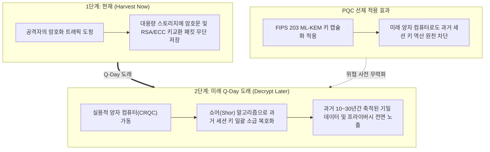
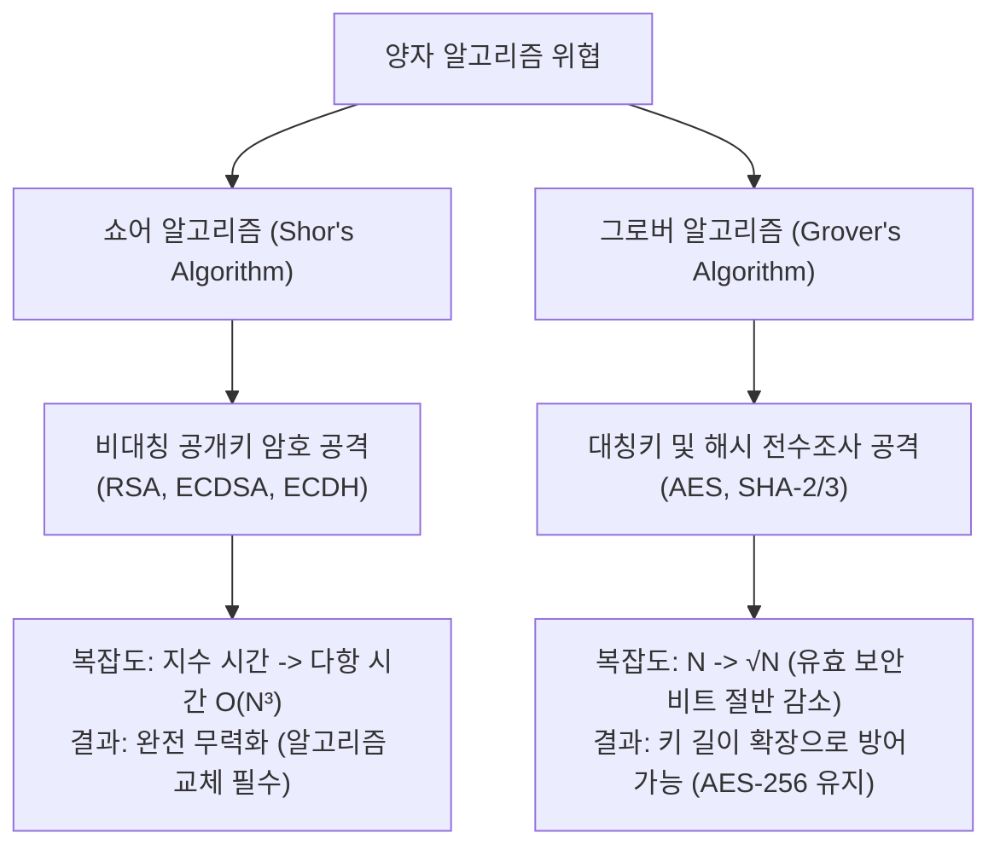
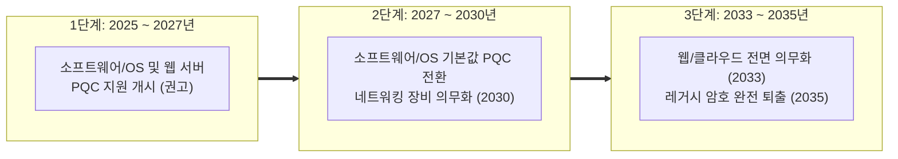

# 03-3. 양자 위협 모델 및 보안 강도 권고 (Security Levels & CNSA 2.0)

## 📌 개요
양자 컴퓨터의 실용화는 기존 인터넷 보안의 전제가 되었던 수학적 난제(소인수분해, 이산로그)를 근본적으로 뒤흔든다. 하지만 모든 암호 알고리즘이 동일한 수준의 위협을 받는 것은 아니다.

본 문서에서는 양자 알고리즘이 고전 암호 체계에 미치는 위협 모델을 분석하고, **왜 대칭키 암호(AES-256)는 새로운 알고리즘으로 교체할 필요가 없는지**, 그리고 **NIST 보안 카테고리(Category 1/3/5)** 및 **미국 국가안보국(NSA) CNSA 2.0 가이드라인**에 따른 실무 마이그레이션 기준을 제시한다.

---

## 🔍 양자 알고리즘별 위협 모델 분석

양자 컴퓨팅이 암호학에 미치는 영향은 크게 **쇼어 알고리즘(Shor's Algorithm)**과 **그로버 알고리즘(Grover's Algorithm)**으로 구분된다:

### 1. 쇼어 알고리즘: 비대칭 암호의 완전 붕괴
- **영향 대상**: RSA (소인수분해), ECC/ECDSA/ECDH (타원곡선 이산로그), DH (유한체 이산로그)
- **위협 수준**: **치명적 (Catastrophic)**
- **이유**: 주기성(Periodicity)을 찾는 양자 푸리에 변환(QFT)을 통해 지수 시간의 복잡도를 **다항 시간 $O(n^3)$**으로 단축하므로, 키 길이를 늘리는 방식으로는 방어가 불가능하며 **ML-KEM / ML-DSA 등 격자 기반 PQC로의 전면 교체가 필수적**이다.

### 2. 그로버 알고리즘: 대칭키 암호의 검색 속도 향상
- **영향 대상**: AES-GCM, ChaCha20, SHA-256, SHA-384, SHA-512
- **위협 수준**: **제한적 (Manageable)**
- **이유**: 정렬되지 않은 $N$개의 데이터베이스 검색 복잡도를 **$O(\sqrt{N})$**으로 단축한다. 즉, 대칭키의 유효 보안 강도를 정확히 **절반($k 
ightarrow k/2$)**으로 감소시킨다.

---

## 🛡 왜 대칭키 암호(AES)는 PQC로 교체하지 않는가?

대칭키 암호는 새로운 알고리즘으로 마이그레이션할 필요 없이 **키 길이를 256비트로 유지**하는 것만으로 양자 내성을 완벽히 확보할 수 있다:

| 대칭키 알고리즘 | 고전 보안 강도 | 그로버 알고리즘 적용 시 양자 유효 보안 | 보안 상태 및 권고 |
| :--- | :--- | :--- | :--- |
| **AES-128** | 128 비트 | **64 비트** | ⚠️ **위험** (슈퍼컴퓨터/양자 탐색 가능 영역) |
| **AES-192** | 192 비트 | **96 비트** | ⚠️ **비권장** |
| **AES-256** | 256 비트 | **128 비트** |  **안전** (물리적으로 전수조사 불가능) |

> **💡 실무 결론:** 
> 현대 암호학에서 128비트 보안은 전 우주의 원자 수와 물리적 에너지를 고려할 때 전수조사가 불가능한 절대적 안전선이다. 따라서 **AES-256은 양자 컴퓨터 공격을 받더라도 128비트의 안전성을 온전히 유지**하므로, PQC 전환 시 대칭 암호화 계층은 **AES-256-GCM**을 그대로 사용한다.

---

## 📊 NIST 양자 보안 카테고리 (Category 1 ~ 5)

NIST는 포스트 퀀텀 암호 알고리즘의 보안 수준을 대칭키 및 해시 함수의 공격 난이도와 비교하여 5단계로 정의했다:

| NIST Category | 기준 난이도 (Equivalence) | 해당 PQC KEM 규격 | 해당 PQC 서명 규격 | 실무 권장 영역 |
| :--- | :--- | :--- | :--- | :--- |
| **Category 1** | AES-128 전수조사 공격 난이도 | **ML-KEM-512** | - | 초경량 IoT / 임베디드 |
| **Category 2** | SHA-256 충돌 탐색 공격 난이도 | - | **ML-DSA-44** | 경량 전자서명 |
| **Category 3** | **AES-192 전수조사 공격 난이도** | **ML-KEM-768** | **ML-DSA-65** | **범용 인터넷 표준 (기본 권고)** |
| **Category 5** | **AES-256 전수조사 공격 난이도** | **ML-KEM-1024** | **ML-DSA-87** | **국가 기밀 / 금융 / 최고 보안** |

---

## 🏛 미국 NSA CNSA 2.0 가이드라인 및 전환 로드맵

미국 국가안보국(NSA)은 2022년 9월 국가안보시스템(NSS)에 적용될 **CNSA 2.0 (Commercial National Security Algorithm Suite 2.0)**을 발표하고, 최고 보안 등급(NIST Category 5)을 의무화했다:

### 1. CNSA 2.0 규격 매핑
- **공개키 암호화 (KEM)**: `ML-KEM-1024` (또는 FIPS 203 Cat 5)
- **전자서명 (Digital Signature)**: `ML-DSA-87` (또는 State-based `LMS` / `XMSS`)
- **대칭키 암호화 (Symmetric Cipher)**: `AES-256`
- **해시 함수 (Hash)**: `SHA-384` 또는 `SHA-512`

### 2. 단계별 마이그레이션 타임라인

---

## 🎯 실무 엔지니어링 의사결정 매트릭스

실무 시스템 구축 시 성능과 보안 요구사항에 따라 아래 매트릭스를 적용한다:

1. **일반 웹/모바일 서비스 및 클라우드 API (Category 3 권장)**:
   - **조합**: `ML-KEM-768` + `ML-DSA-65` + `AES-256-GCM`
   - **이유**: 공개키(1184B)와 암호문(1088B)이 1500B Ethernet MTU 내에 수납되어 TCP 패킷 단편화가 발생하지 않으며, 성능 저하 없이 192비트 양자 보안 확보.
2. **국가 기밀, 금융 코어망, 고신뢰 인프라 (Category 5 / CNSA 2.0 권장)**:
   - **조합**: `ML-KEM-1024` + `ML-DSA-87` + `AES-256-GCM` + `SHA-384`
   - **이유**: NSA CNSA 2.0 규정 준수 및 향후 50년 이상의 장기 보존 데이터 기밀성 보장.
