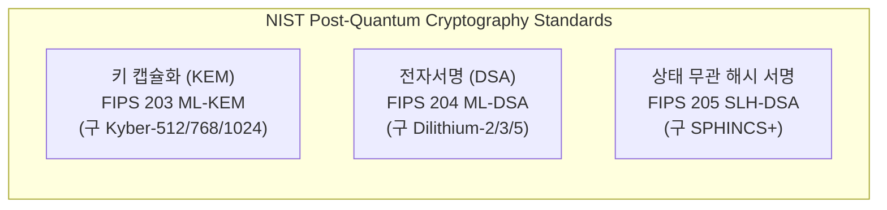

# 03. NIST 표준 PQC 원시 암호 (NIST PQC Primitives)

## 📌 개요
미국 국립표준기술연구소(NIST)는 양자 컴퓨터의 쇼어(Shor) 알고리즘 공격에 안전한 양자내성 암호 표준을 확정 발표했습니다. 본 랩에서는 핵심 표준인 **FIPS 203 (ML-KEM)**과 **FIPS 204 (ML-DSA)**를 중점적으로 다룹니다.

---

## 🔍 주요 다룰 내용 (Phase 3 예정)
- FIPS 203 ML-KEM 키 생성, 캡슐화(`Encap`), 역캡슐화(`Decap`) 시각화
- FIPS 204 ML-DSA 서명 생성 및 검증 메커니즘
- 양자 보안 강도(NIST Cat 1/3/5, CNSA 2.0 권고) 및 파라미터별 키/암호문 크기 비교
- OpenSSL 3.5+, Rust, C++ 네이티브 연동
