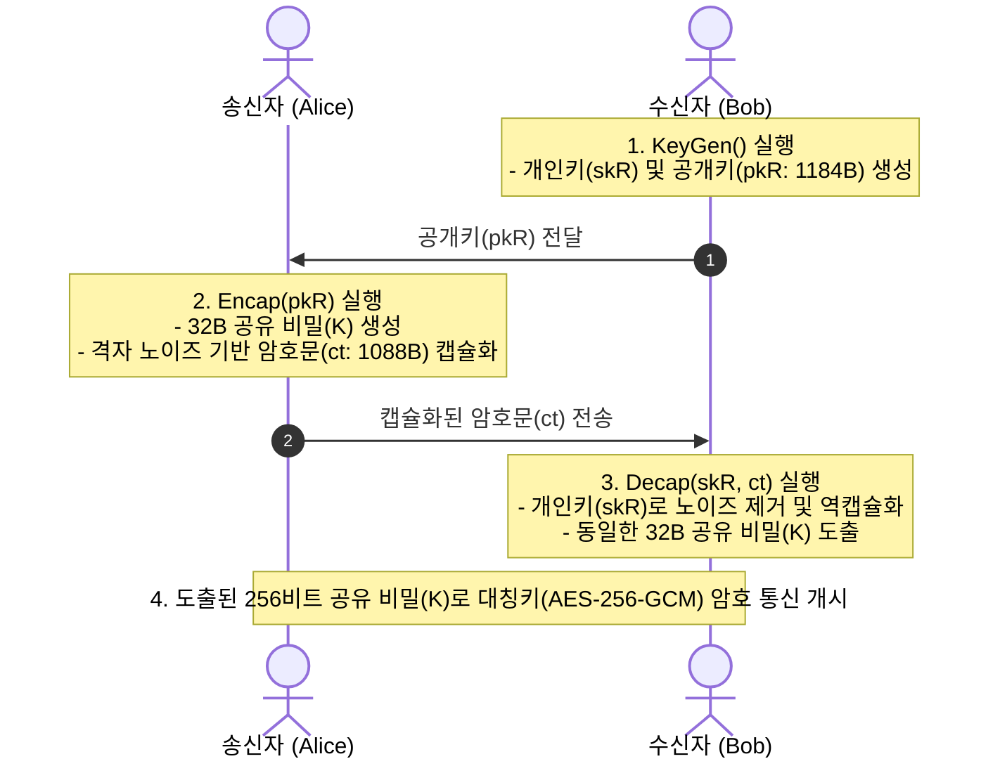

# 03. NIST FIPS 203 ML-KEM (Post-Quantum Key Encapsulation)

## 📌 개요
2024년 8월, 미국 국립표준기술연구소(NIST)는 쇼어(Shor) 알고리즘을 탑재한 미래 양자 컴퓨터의 위협으로부터 공개키 암호를 보호하기 위해 최초의 포스트 퀀텀 암호화 표준 **FIPS 203 ML-KEM (Module-Lattice-Based Key-Encapsulation Mechanism, 구 Kyber)**을 공식 확정 발표했다. 

본 챕터에서는 기존 RSA / ECDH를 대체하는 **FIPS 203 ML-KEM**의 핵심 동작 원리(`KeyGen`, `Encap`, `Decap`)와 4개 언어(Python, Rust, C++20, OpenSSL 3.5+ CLI) 구현을 검증한다.



---

## 🔍 직관적인 동작 메커니즘 & 격자 암호 원리

### 1. 양자 컴퓨터가 RSA/ECC는 깨고 격자 암호는 못 깨는 이유
- **고전 암호의 취약성 (RSA / ECC)**:
  - 거대한 정수의 소인수분해나 타원곡선 이산로그 문제는 수학적 구조의 '주기성(Periodicity)'이 정돈되어 있어 양자 컴퓨터의 쇼어 알고리즘(Shor's Algorithm)에 의해 단항 시간 내에 풀린다.
- **격자 암호의 원리 (Module-LWE)**:
  - ML-KEM은 고차원 다항식 격자 공간에서 **"미세한 임의의 오차(Noise)가 섞인 연립일차방정식"**을 푸는 문제(Learning With Errors)에 기반한다.
  - 비밀키를 모르는 공격자는 노이즈 때문에 정답 격자점을 역추적할 수 없으며, 양자 컴퓨터를 동원하더라도 주기성이 없어 지수 시간의 복잡도가 요구된다.


---

## 📊 FIPS 203 ML-KEM 파라미터 규격 비교

NIST는 보안 강도와 성능 요구사항에 따라 3가지 공식 파라미터 세트를 정의했다:

| 파라미터 규격 | 보안 강도 (NIST Category) | 공개키 크기 (pk) | 암호문 크기 (ct) | 공유 비밀 크기 (K) | 권장 실무 적용 분야 |
| :--- | :--- | :--- | :--- | :--- | :--- |
| **ML-KEM-512** | Cat 1 (AES-128급) | 800 Bytes | 768 Bytes | 32 Bytes (256-bit) | 제한된 경량 IoT / 임베디드 |
| **ML-KEM-768** | **Cat 3 (AES-192급)** | **1,184 Bytes** | **1,088 Bytes** | **32 Bytes (256-bit)** | **범용 인터넷 표준 (기본 권고)** |
| **ML-KEM-1024** | Cat 5 (AES-256급) | 1,568 Bytes | 1,568 Bytes | 32 Bytes (256-bit) | 국방 / 국가 기밀 / 최고 보안 |

> **💡 왜 ML-KEM-768이 글로벌 표준인가?**<br>
> `ML-KEM-768`은 공개키(1184B)와 암호문(1088B) 크기가 모두 표준 네트워크 MTU(1500 바이트) 이내에 수납되어, TCP 패킷 단편화(Fragmentation)를 유발하지 않으면서도 양자 컴퓨터에 대해 192비트 이상의 강력한 보안성을 제공한다.

---

## 💻 실행 가능한 4개 언어 검증 코드

아래 탭은 OpenSSL 3.5+ 네이티브 FIPS 203 엔진(`EVP_PKEY_encapsulate`, `EVP_PKEY_decapsulate`)을 연동한 4개 언어의 완전한 E2E 검증 코드이다:

=== "Python"

    ```python
    # Python 3 - OpenSSL 3.5+ 네이티브 FIPS 203 ML-KEM-768 Encap / Decap
    import ctypes
    from ctypes import c_void_p, c_char_p, c_size_t, c_int, POINTER, byref, create_string_buffer

    libcrypto = ctypes.CDLL("/opt/openssl/lib/libcrypto.so")

    # EVP C 함수 프로토타입 정의
    libcrypto.EVP_PKEY_CTX_new_from_name.restype = c_void_p
    libcrypto.EVP_PKEY_CTX_new.restype = c_void_p

    # 1. 수신자 ML-KEM-768 키쌍 생성
    kctx = libcrypto.EVP_PKEY_CTX_new_from_name(None, b"ML-KEM-768", None)
    libcrypto.EVP_PKEY_keygen_init(kctx)
    pkey = c_void_p()
    libcrypto.EVP_PKEY_keygen(kctx, byref(pkey))
    libcrypto.EVP_PKEY_CTX_free(kctx)

    # 2. 송신자: Encap(pkR) 실행 (암호문 1088B + 32B 공유비밀 생성)
    ectx = libcrypto.EVP_PKEY_CTX_new(pkey, None)
    libcrypto.EVP_PKEY_encapsulate_init(ectx, None)
    ct_len, secret_len = c_size_t(0), c_size_t(0)
    libcrypto.EVP_PKEY_encapsulate(ectx, None, byref(ct_len), None, byref(secret_len))

    ct_buf = create_string_buffer(ct_len.value)
    secret_s = create_string_buffer(secret_len.value)
    libcrypto.EVP_PKEY_encapsulate(ectx, ct_buf, byref(ct_len), secret_s, byref(secret_len))
    libcrypto.EVP_PKEY_CTX_free(ectx)

    # 3. 수신자: Decap(skR, ct) 실행
    dctx = libcrypto.EVP_PKEY_CTX_new(pkey, None)
    libcrypto.EVP_PKEY_decapsulate_init(dctx, None)
    dec_len = c_size_t(0)
    secret_r = create_string_buffer(secret_len.value)
    libcrypto.EVP_PKEY_decapsulate(dctx, secret_r, byref(dec_len), ct_buf, ct_len.value)
    libcrypto.EVP_PKEY_CTX_free(dctx)

    assert secret_s.raw == secret_r.raw
    print(f"[PASS] PQC Shared Secret Established: {secret_len.value} bytes")
    libcrypto.EVP_PKEY_free(pkey)
    ```

=== "Rust"

    ```rust
    // Rust 2021/2024 Edition - OpenSSL 3.5 FIPS 203 ML-KEM-768
    use openssl_sys::*;
    use std::ffi::CString;
    use std::ptr;

    fn main() -> Result<(), Box<dyn std::error::Error>> {
        unsafe {
            // 1. 수신자 ML-KEM-768 키쌍 생성
            let name = CString::new("ML-KEM-768")?;
            let kctx = EVP_PKEY_CTX_new_from_name(ptr::null_mut(), name.as_ptr(), ptr::null_mut());
            EVP_PKEY_keygen_init(kctx);
            let mut pkey: *mut EVP_PKEY = ptr::null_mut();
            EVP_PKEY_keygen(kctx, &mut pkey);
            EVP_PKEY_CTX_free(kctx);

            // 2. 송신자: Encap(pkR)
            let ectx = EVP_PKEY_CTX_new(pkey, ptr::null_mut());
            EVP_PKEY_encapsulate_init(ectx, ptr::null_mut());
            let mut ct_len = 0usize;
            let mut secret_len = 0usize;
            EVP_PKEY_encapsulate(ectx, ptr::null_mut(), &mut ct_len, ptr::null_mut(), &mut secret_len);

            let mut ct = vec![0u8; ct_len];
            let mut secret_s = vec![0u8; secret_len];
            EVP_PKEY_encapsulate(ectx, ct.as_mut_ptr(), &mut ct_len, secret_s.as_mut_ptr(), &mut secret_len);
            EVP_PKEY_CTX_free(ectx);

            // 3. 수신자: Decap(skR, ct)
            let dctx = EVP_PKEY_CTX_new(pkey, ptr::null_mut());
            EVP_PKEY_decapsulate_init(dctx, ptr::null_mut());
            let mut secret_r = vec![0u8; secret_len];
            EVP_PKEY_decapsulate(dctx, secret_r.as_mut_ptr(), &mut secret_len, ct.as_ptr(), ct_len);
            EVP_PKEY_CTX_free(dctx);

            assert_eq!(secret_s, secret_r);
            println!("[PASS] ML-KEM-768 Rust Encap/Decap: ct={}B, secret={}B", ct_len, secret_len);
            EVP_PKEY_free(pkey);
        }
        Ok(())
    }
    ```

=== "C++"

    ```cpp
    // C++20 - OpenSSL 3.5 EVP API ML-KEM-768
    #include <iostream>
    #include <vector>
    #include <memory>
    #include <cassert>
    #include <openssl/evp.h>

    struct EvpPkeyDeleter { void operator()(EVP_PKEY* p) const { if (p) EVP_PKEY_free(p); } };
    struct EvpPkeyCtxDeleter { void operator()(EVP_PKEY_CTX* p) const { if (p) EVP_PKEY_CTX_free(p); } };

    int main() {
        // 1. 수신자 ML-KEM-768 키쌍 생성
        std::unique_ptr<EVP_PKEY_CTX, EvpPkeyCtxDeleter> kctx(EVP_PKEY_CTX_new_from_name(nullptr, "ML-KEM-768", nullptr));
        EVP_PKEY_keygen_init(kctx.get());
        EVP_PKEY* raw_pkey = nullptr;
        EVP_PKEY_keygen(kctx.get(), &raw_pkey);
        std::unique_ptr<EVP_PKEY, EvpPkeyDeleter> pkey(raw_pkey);

        // 2. 송신자 Encap
        std::unique_ptr<EVP_PKEY_CTX, EvpPkeyCtxDeleter> ectx(EVP_PKEY_CTX_new(pkey.get(), nullptr));
        EVP_PKEY_encapsulate_init(ectx.get(), nullptr);
        size_t ct_len = 0, secret_len = 0;
        EVP_PKEY_encapsulate(ectx.get(), nullptr, &ct_len, nullptr, &secret_len);
        std::vector<uint8_t> ct(ct_len), secret_s(secret_len);
        EVP_PKEY_encapsulate(ectx.get(), ct.data(), &ct_len, secret_s.data(), &secret_len);

        // 3. 수신자 Decap
        std::unique_ptr<EVP_PKEY_CTX, EvpPkeyCtxDeleter> dctx(EVP_PKEY_CTX_new(pkey.get(), nullptr));
        EVP_PKEY_decapsulate_init(dctx.get(), nullptr);
        std::vector<uint8_t> secret_r(secret_len);
        EVP_PKEY_decapsulate(dctx.get(), secret_r.data(), &secret_len, ct.data(), ct_len);

        assert(secret_s == secret_r);
        std::cout << "[PASS] C++20 ML-KEM-768 Verified: ct=" << ct_len << "B, secret=" << secret_len << "B" << std::endl;
        return 0;
    }
    ```

=== "OpenSSL CLI"

    ```bash
    # OpenSSL 3.5 CLI 기반 FIPS 203 ML-KEM-768 Encap / Decap

    # 1. 수신자 ML-KEM-768 개인키 및 공개키 생성
    openssl genpkey -algorithm ML-KEM-768 -out rec_priv.pem
    openssl pkey -in rec_priv.pem -pubout -out rec_pub.pem

    # 2. 송신자: 32바이트 공유 비밀 캡슐화 (Encap)
    openssl pkeyutl -encap -pubin -inkey rec_pub.pem -out ct.bin -secret sender_secret.bin

    # 3. 수신자: 암호문 역캡슐화 (Decap)
    openssl pkeyutl -decap -inkey rec_priv.pem -in ct.bin -secret rec_secret.bin

    # 4. 도출된 256비트 공유 비밀 일치 검증
    diff -u sender_secret.bin rec_secret.bin
    ```
