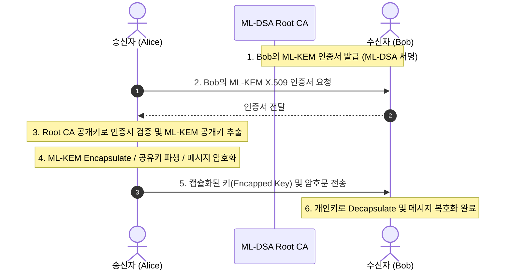

# 04. PQC X.509 PKI & End-to-End Encryption

## 📌 개요
양자내성 환경에서는 신원 증명과 인증서 서명에 **ML-DSA(FIPS 204)**가 사용되고, 기밀 통신을 위한 암호화 공개키 배포에는 **ML-KEM(FIPS 203)** 인증서가 활용된다. 본 장에서는 순수 PQC 기반의 X.509 Root CA, Intermediate CA 및 End-Entity 인증서 발급과 E2E 암호화 워크플로우를 다룬다.

---

## 🔍 주요 다룰 내용 (Phase 4 예정)
- OpenSSL 3.5 CLI 기반 PKI 발급 자동화 스크립트 (`run_pki.sh`)
- ML-DSA CA 체인 및 ML-KEM 종단 인증서 생성
- Rust 및 C++ 기반 X.509 파싱 + HPKE 결합 E2E 테스트
