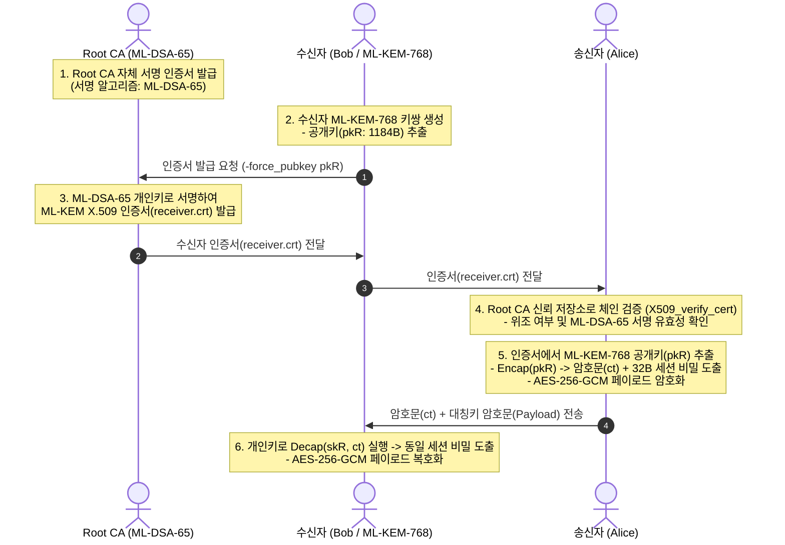
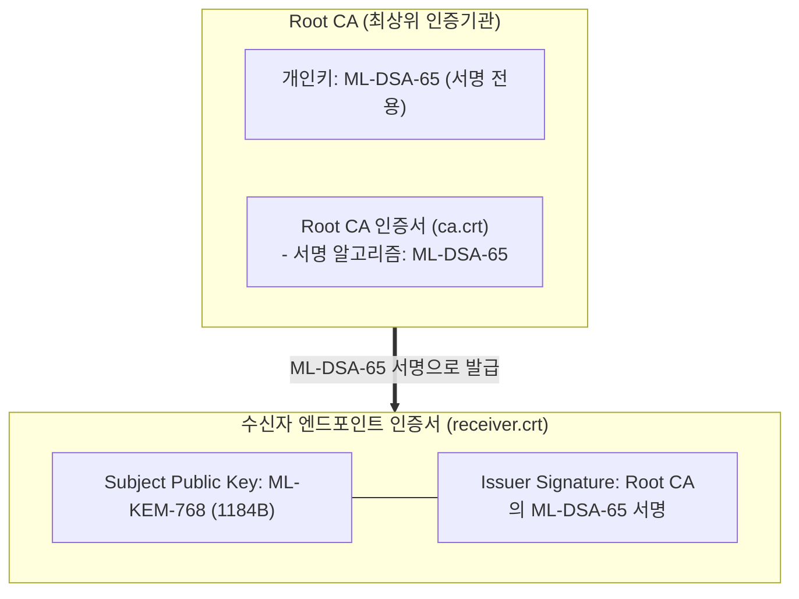

# 04. PQC X.509 PKI & End-to-End Encryption

## 📌 개요
고전 공개키 암호(RSA)는 단일 알고리즘으로 전자서명과 키 암호화를 모두 처리할 수 있었다. 반면 포스트 퀀텀 암호(PQC)는 **키 캡슐화 전용 알고리즘(FIPS 203 ML-KEM)**과 **전자서명 전용 알고리즘(FIPS 204 ML-DSA)**으로 역할이 엄격히 분리되어 있다.

따라서 양자 내성 X.509 공개키 기반구조(PKI)에서는 **인증서 발급/서명에는 ML-DSA**를, **수신자의 암호화 엔드포인트에는 ML-KEM**을 탑재하는 **이원화 키 아키텍처(Dual-Key Architecture)**가 필수적이다.

본 챕터에서는 OpenSSL 3.5+ 기반의 PQC PKI 자동 발급(`run_pki.sh`) 및 발급된 인증서 체인을 검증하여 종단간 암호화(E2E)를 수행하는 4개 언어(Python, Rust, C++20, OpenSSL CLI) 구현을 검증한다.



---

## 🔍 PQC 이원화 키 아키텍처 (Dual-Key PKI)



### 1. 왜 KEM 키 인증서 발급 시 `-force_pubkey`가 필요한가?
- **고전 PKCS#10 CSR의 한계**:
  - 표준 CSR(인증서 서명 요청서)은 요청자가 개인키를 보유하고 있음을 증명하기 위해 자체 서명(Proof-of-Possession)을 요구한다.
  - 하지만 **ML-KEM은 키 캡슐화 전용 알고리즘**이므로 자체 서명을 생성할 수 없다.
- **OpenSSL 3.5 해결 방식**:
  - OpenSSL 3.5+ CLI에서는 CA가 `-force_pubkey receiver_pub.pem` 옵션을 통해 ML-KEM 공개키를 X.509 인증서의 `SubjectPublicKeyInfo` 필드에 직접 주입하여 발급한다.

---

## 💻 실행 가능한 4개 언어 검증 코드

아래 탭은 발급된 PQC X.509 인증서 체인을 검증하고, ML-KEM 공개키를 추출하여 종단간 대칭 암호화(AES-256-GCM)를 수행하는 4개 언어의 완전한 E2E 코드이다:

=== "Python"

    ```python
    # Python 3 - OpenSSL 3.5+ PQC X.509 체인 검증 + ML-KEM-768 + AES-256-GCM
    import ctypes
    from ctypes import c_void_p, c_char_p, c_size_t, c_int, POINTER, byref, create_string_buffer

    libcrypto = ctypes.CDLL("/opt/openssl/lib/libcrypto.so")

    # 1. 인증서 파일 로드 (Root CA & Receiver Cert)
    bio_ca = libcrypto.BIO_new_file(b"ca.crt", b"r")
    ca_cert = libcrypto.PEM_read_bio_X509(bio_ca, None, None, None)
    bio_leaf = libcrypto.BIO_new_file(b"receiver.crt", b"r")
    leaf_cert = libcrypto.PEM_read_bio_X509(bio_leaf, None, None, None)

    # 2. X.509 인증서 체인 검증 (ML-DSA-65 서명 검증)
    store = libcrypto.X509_STORE_new()
    libcrypto.X509_STORE_add_cert(store, ca_cert)
    vctx = libcrypto.X509_STORE_CTX_new()
    libcrypto.X509_STORE_CTX_init(vctx, store, leaf_cert, None)
    assert libcrypto.X509_verify_cert(vctx) == 1
    print("[PASS] X.509 Certificate Chain Verified (ML-DSA-65 Root CA)!")

    # 3. 인증서에서 ML-KEM-768 공개키 추출 및 Encap
    extracted_pk = libcrypto.X509_get0_pubkey(leaf_cert)
    ectx = libcrypto.EVP_PKEY_CTX_new(extracted_pk, None)
    libcrypto.EVP_PKEY_encapsulate_init(ectx, None)
    ct_len, secret_len = c_size_t(0), c_size_t(0)
    libcrypto.EVP_PKEY_encapsulate(ectx, None, byref(ct_len), None, byref(secret_len))
    ct_buf = create_string_buffer(ct_len.value)
    secret_s = create_string_buffer(secret_len.value)
    libcrypto.EVP_PKEY_encapsulate(ectx, ct_buf, byref(ct_len), secret_s, byref(secret_len))

    # 4. 수신자: 개인키로 Decap
    bio_priv = libcrypto.BIO_new_file(b"receiver.key", b"r")
    rec_priv = libcrypto.PEM_read_bio_PrivateKey(bio_priv, None, None, None)
    dctx = libcrypto.EVP_PKEY_CTX_new(rec_priv, None)
    libcrypto.EVP_PKEY_decapsulate_init(dctx, None)
    secret_r = create_string_buffer(secret_len.value)
    dec_len = c_size_t(secret_len.value)
    libcrypto.EVP_PKEY_decapsulate(dctx, secret_r, byref(dec_len), ct_buf, ct_len.value)

    assert secret_s.raw == secret_r.raw
    print("[PASS] PQC X.509 PKI End-to-End Key Establishment Succeeded!")
    ```

=== "Rust"

    ```rust
    // Rust 2021/2024 Edition - PQC X.509 PKI E2E Encryption
    use openssl::x509::{store::X509StoreBuilder, X509StoreContext, X509};
    use openssl::pkey::PKey;
    use openssl::stack::Stack;
    use foreign_types::ForeignType;
    use openssl_sys::*;
    use std::fs;
    use std::ptr;

    fn main() -> Result<(), Box<dyn std::error::Error>> {
        let ca_cert = X509::from_pem(&fs::read("ca.crt")?)?;
        let leaf_cert = X509::from_pem(&fs::read("receiver.crt")?)?;

        // 1. X.509 체인 검증
        let mut store_builder = X509StoreBuilder::new()?;
        store_builder.add_cert(ca_cert)?;
        let store = store_builder.build();
        let mut ctx = X509StoreContext::new()?;
        let chain = Stack::new()?;
        assert!(ctx.init(&store, &leaf_cert, &chain, |c| c.verify_cert())?);
        println!("[PASS] Rust X.509 Certificate Chain Verified!");

        // 2. 인증서에서 ML-KEM-768 공개키 추출 및 Encap
        let pubkey = leaf_cert.public_key()?;
        let (ct, sender_secret) = unsafe {
            let ectx = EVP_PKEY_CTX_new(pubkey.as_ptr(), ptr::null_mut());
            EVP_PKEY_encapsulate_init(ectx, ptr::null_mut());
            let mut ct_len = 0usize;
            let mut secret_len = 0usize;
            EVP_PKEY_encapsulate(ectx, ptr::null_mut(), &mut ct_len, ptr::null_mut(), &mut secret_len);
            let mut ct = vec![0u8; ct_len];
            let mut secret = vec![0u8; secret_len];
            EVP_PKEY_encapsulate(ectx, ct.as_mut_ptr(), &mut ct_len, secret.as_mut_ptr(), &mut secret_len);
            EVP_PKEY_CTX_free(ectx);
            (ct, secret)
        };

        // 3. 수신자 Decap
        let rec_priv = PKey::private_key_from_pem(&fs::read("receiver.key")?)?;
        let receiver_secret = unsafe {
            let dctx = EVP_PKEY_CTX_new(rec_priv.as_ptr(), ptr::null_mut());
            EVP_PKEY_decapsulate_init(dctx, ptr::null_mut());
            let mut secret = vec![0u8; sender_secret.len()];
            let mut secret_len = sender_secret.len();
            EVP_PKEY_decapsulate(dctx, secret.as_mut_ptr(), &mut secret_len, ct.as_ptr(), ct.len());
            EVP_PKEY_CTX_free(dctx);
            secret
        };

        assert_eq!(sender_secret, receiver_secret);
        println!("[PASS] Rust PQC X.509 PKI End-to-End Succeeded!");
        Ok(())
    }
    ```

=== "C++"

    ```cpp
    // C++20 - PQC X.509 PKI E2E Encryption
    #include <iostream>
    #include <vector>
    #include <memory>
    #include <cassert>
    #include <openssl/x509.h>
    #include <openssl/x509_vfy.h>
    #include <openssl/pem.h>
    #include <openssl/evp.h>

    struct X509Deleter { void operator()(X509* p) const { if (p) X509_free(p); } };
    struct EvpPkeyDeleter { void operator()(EVP_PKEY* p) const { if (p) EVP_PKEY_free(p); } };

    int main() {
        FILE* ca_f = fopen("ca.crt", "r");
        std::unique_ptr<X509, X509Deleter> ca_cert(PEM_read_X509(ca_f, nullptr, nullptr, nullptr));
        fclose(ca_f);

        FILE* leaf_f = fopen("receiver.crt", "r");
        std::unique_ptr<X509, X509Deleter> leaf_cert(PEM_read_X509(leaf_f, nullptr, nullptr, nullptr));
        fclose(leaf_f);

        // 1. X.509 체인 검증
        X509_STORE* store = X509_STORE_new();
        X509_STORE_add_cert(store, ca_cert.get());
        X509_STORE_CTX* vctx = X509_STORE_CTX_new();
        X509_STORE_CTX_init(vctx, store, leaf_cert.get(), nullptr);
        assert(X509_verify_cert(vctx) == 1);
        std::cout << "[PASS] C++20 X.509 Certificate Chain Verified!" << std::endl;

        // 2. ML-KEM-768 공개키 추출 및 Encap
        EVP_PKEY* extracted_pk = X509_get0_pubkey(leaf_cert.get());
        EVP_PKEY_CTX* ectx = EVP_PKEY_CTX_new(extracted_pk, nullptr);
        EVP_PKEY_encapsulate_init(ectx, nullptr);
        size_t ct_len = 0, secret_len = 0;
        EVP_PKEY_encapsulate(ectx, nullptr, &ct_len, nullptr, &secret_len);
        std::vector<uint8_t> ct(ct_len), secret_s(secret_len);
        EVP_PKEY_encapsulate(ectx, ct.data(), &ct_len, secret_s.data(), &secret_len);
        EVP_PKEY_CTX_free(ectx);

        // 3. 수신자 Decap
        FILE* key_f = fopen("receiver.key", "r");
        std::unique_ptr<EVP_PKEY, EvpPkeyDeleter> rec_priv(PEM_read_PrivateKey(key_f, nullptr, nullptr, nullptr));
        fclose(key_f);

        EVP_PKEY_CTX* dctx = EVP_PKEY_CTX_new(rec_priv.get(), nullptr);
        EVP_PKEY_decapsulate_init(dctx, nullptr);
        std::vector<uint8_t> secret_r(secret_len);
        EVP_PKEY_decapsulate(dctx, secret_r.data(), &secret_len, ct.data(), ct.size());
        EVP_PKEY_CTX_free(dctx);

        assert(secret_s == secret_r);
        std::cout << "[PASS] C++20 PQC PKI End-to-End Succeeded!" << std::endl;
        return 0;
    }
    ```

=== "OpenSSL CLI"

    ```bash
    # OpenSSL 3.5 CLI 기반 PQC X.509 PKI 발급 및 암호화 검증

    # 1. Root CA 생성 (ML-DSA-65)
    openssl req -x509 -newkey ML-DSA-65 -days 3650 -nodes -keyout ca.key -out ca.crt -subj "/CN=Applied PQC Root CA"

    # 2. 수신자 ML-KEM-768 키 생성 및 공개키 추출
    openssl genpkey -algorithm ML-KEM-768 -out receiver.key
    openssl pkey -in receiver.key -pubout -out receiver_pub.pem

    # 3. Root CA가 수신자 인증서 발급 (-force_pubkey)
    openssl x509 -new -CA ca.crt -CAkey ca.key -CAcreateserial         -subj "/CN=pqc-receiver.local" -force_pubkey receiver_pub.pem -out receiver.crt -days 365

    # 4. 체인 검증 및 공개키 추출 후 Encap
    openssl verify -CAfile ca.crt receiver.crt
    openssl x509 -in receiver.crt -pubkey -noout -out extracted_pub.pem
    openssl pkeyutl -encap -pubin -inkey extracted_pub.pem -out ct.bin -secret sender_secret.bin

    # 5. 수신자 Decap 및 일치 검증
    openssl pkeyutl -decap -inkey receiver.key -in ct.bin -secret rec_secret.bin
    diff -u sender_secret.bin rec_secret.bin
    ```
