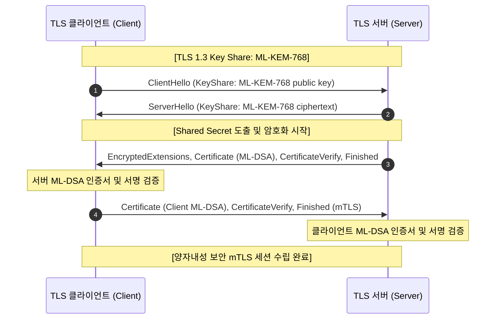

# 05. PQC TLS 1.3 / mTLS Hands-on

## 📌 개요
TLS 1.3 핸드셰이크에서 키 교환(Key Exchange)은 **ML-KEM**으로 수행되고, 서버/클라이언트 상호 인증(mTLS)을 위한 디지털 서명은 **ML-DSA**로 수행됩니다. 본 장에서는 OpenSSL 3.5 기반의 PQC TLS 1.3 연결 및 상호 인증(mTLS)을 직접 구성하고 검증합니다.

---

## 🔍 주요 다룰 내용 (Phase 5 예정)
- PQC TLS 1.3 핸드셰이크 단계별 패킷 구조 및 암호 알고리즘 매핑
- OpenSSL 3.5 `s_server` / `s_client` 기반 ML-DSA + ML-KEM mTLS 양방향 테스트
- 자동화된 E2E 검증 테스트 하네스
