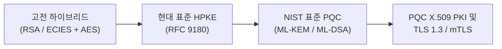

# Applied PQC Lab (양자내성암호 엔지니어링 랩)

**Applied PQC Lab**은 고전 하이브리드 암호부터 RFC 9180 HPKE, NIST 표준 양자내성암호(PQC: FIPS 203/204), X.509 PKI, 그리고 TLS 1.3/mTLS에 이르는 현대 응용 암호학 메커니즘을 시각적으로 분석하고 코드로 검증하는 엔지니어링 실습 랩이다.

---

## 🎯 랩의 핵심 목표



1. **시각적 흐름 중심 (Visual-First)**: 복잡한 수학 수식 대신 Mermaid 다이어그램과 데이터 흐름도를 통해 동작 원리를 직관적이고 쉽게 이해한다.
2. **4개 언어 실습 예제**: Python 3, Rust, C++20, OpenSSL 3.5+ CLI로 구현된 완전한 E2E 예제를 제공한다.
3. **완전 격리 환경 (Docker-Based)**: 호스트 환경을 오염시키지 않고 재현 가능한 Docker 컨테이너에서 모든 실습을 원클릭으로 검증한다.

---

## 📚 로드맵 개요

| 파트 | 주제 | 핵심 내용 |
| :--- | :--- | :--- |
| **01. Classical Hybrid** | 고전 하이브리드 암호 | RSA / ECIES 키 래핑 방식의 구조와 한계 |
| **02. Modern HPKE** | RFC 9180 HPKE | KEM + KDF + AEAD 모듈형 아키텍처 및 Base 모드 |
| **03. PQC Primitives** | NIST 표준 PQC 원시 암호 | FIPS 203 ML-KEM (구 Kyber) 및 FIPS 204 ML-DSA (구 Dilithium) |
| **04. PQC PKI & X.509** | 양자내성 공개키 인프라 | ML-DSA Root CA 발급 및 ML-KEM 수신자 인증서 연동 |
| **05. PQC TLS & mTLS** | PQC TLS 1.3 핸즈온 | OpenSSL 3.5 네이티브 기반 ML-DSA / ML-KEM mTLS 통신 |

---

## 🚀 빠른 시작 예시 (4개 언어 탭 미리보기)

=== "Python"

    ```python
    # Python 3 Example
    print("Welcome to Applied PQC Lab!")
    ```

=== "Rust"

    ```rust
    // Rust 2021 Example
    fn main() {
        println!("Welcome to Applied PQC Lab!");
    }
    ```

=== "C++"

    ```cpp
    // C++20 Example
    #include <iostream>

    int main() {
        std::cout << "Welcome to Applied PQC Lab!
";
        return 0;
    }
    ```

=== "OpenSSL CLI"

    ```bash
    # OpenSSL 3.5 CLI Example
    openssl version
    ```
